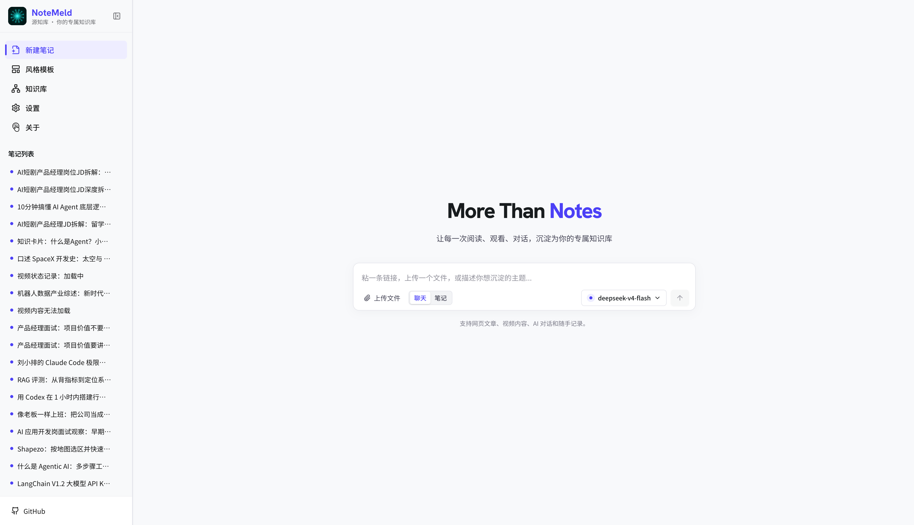
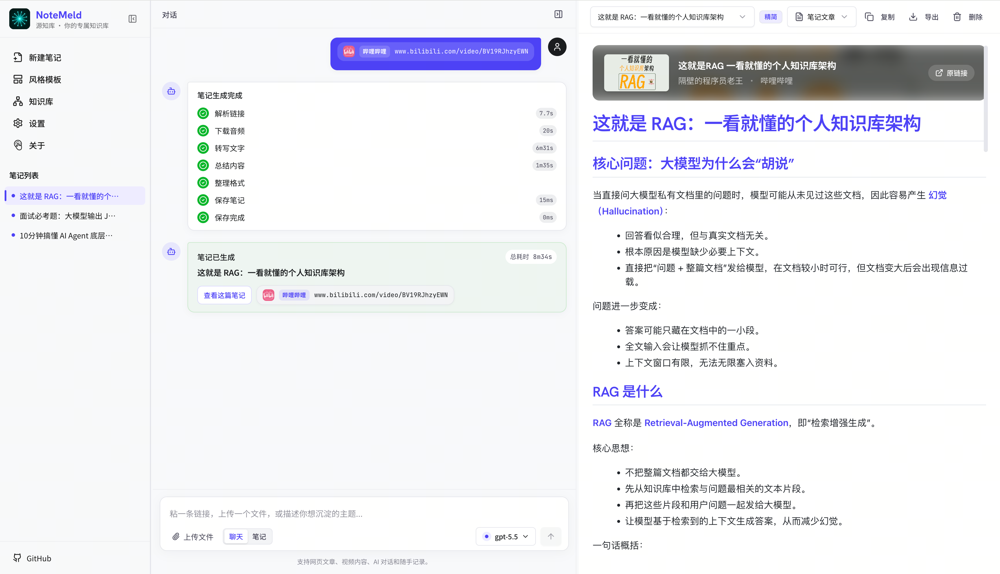
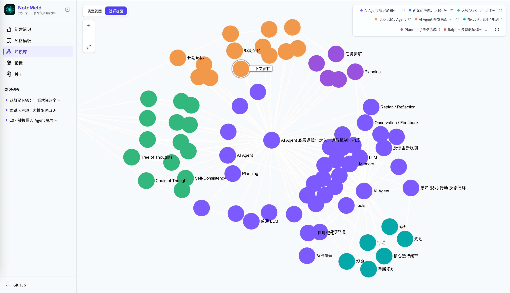

<div align="center">
  <h1>NoteMeld</h1>
  <p><b>源知库 · 你的 AI 研究助手</b></p>
  <p>
    
    
    
    
    
    
  </p>
  <p>
    <a href="https://notemeld.wiki/">官网</a> · 
    <a href="https://notemeld.wiki/faq/">帮助文档</a> · 
    <a href="https://github.com/Hehejie1/NoteMeld/releases">下载</a>
  </p>
</div>

---

## ✨ 什么是 NoteMeld

**NoteMeld（源知库）** 是你的 AI 研究助手——在后台持续运行，把你每天接触的网页、视频、音频、文件、AI 对话，自动整理为结构化 Markdown 笔记，并继续抽取实体、概念、证据与关系，沉淀为**可追溯、可关联、自动生长的个人知识图谱**。

传统知识管理工具要求你手动整理：写笔记、加链接、打标签、建文件夹。NoteMeld 不同——你只需要标记来源，AI 在后台帮你编译知识。需要时，通过检索、问答或 MCP 接入 AI IDE，随时获取参考和来源，辅助决策。

**和 RAG 的区别**：不是"先堆原文再临时检索"，而是 Wiki-First——先编译结构化知识层，再检索和引用。

**和 Obsidian/Notion 的区别**：不是"人手动整理知识"，而是"AI 后台编译，人标记和消费"。

<p align="center">
  
</p>

## 🚀 三步使用

| 步骤 | 说明 |
|---|---|
| **1. 标记来源** | 粘贴链接 / 上传文件 / 接入 AI 对话 |
| **2. AI 后台编译** | AI 自动整理为结构化 Markdown，抽取实体与概念 |
| **3. 随时消费** | 通过 Wiki 图谱检索、问答、MCP 接入 AI IDE，获取参考和来源 |

<p align="center">
  
  
</p>

## 📦 快速安装

### 桌面端（推荐）

从 GitHub Releases 下载 macOS / Windows 安装包：

```bash
# macOS Apple Silicon
# macOS Intel
# Windows
```

👉 <a href="https://github.com/Hehejie1/NoteMeld/releases">前往下载页面</a>

### 一键脚本安装

```bash
# macOS / Linux
curl -fsSL https://notemeld.wiki/install.sh | bash
notemeld

# Windows PowerShell
irm https://notemeld.wiki/install.ps1 | iex
notemeld
```

### 源码启动

```bash
git clone https://github.com/Hehejie1/NoteMeld.git
cd NoteMeld
cp .env.example .env
bash run_notemeld.sh
```

访问：<http://127.0.0.1:3015>

## 🔌 MCP 接入

将 NoteMeld 作为本地知识工具接入 AI IDE：

```bash
# 默认 MCP endpoint
http://127.0.0.1:8483/mcp
```

Claude Code 示例：

```bash
claude mcp add notemeld --transport http http://127.0.0.1:8483/mcp
```

> 详细配置请参阅 <a href="https://notemeld.wiki/faq/">帮助文档</a>

---

## ⚠️ 合规使用声明

本软件定位为**个人知识管理与学习辅助工具**，旨在帮助用户整理和沉淀自己在学习、研究过程中积累的信息资源。使用本软件前，请仔细阅读以下声明：

### 用途限定
- **仅限个人使用**：本软件仅供个人学习、研究和知识整理使用，**严禁**用于任何商业用途或大规模批量处理。
- **本地优先**：所有数据处理均在您的本地设备完成，软件不会将您的内容上传至任何第三方服务器。

### 用户合规义务
- **遵守法律法规**：您必须确保使用本软件的行为符合您所在地的法律法规，包括但不限于《著作权法》《网络安全法》等。
- **遵守平台条款**：在处理来自外部平台的内容时，您必须遵守相应平台的服务条款和使用协议。
- **尊重他人权益**：不得利用本软件侵犯他人的著作权、肖像权、隐私权等合法权益。

### 免责条款
- 本软件按「现状」提供，开发者不对软件的适用性、稳定性、合法性作出任何明示或暗示的保证。
- 用户使用本软件产生的一切后果，由用户自行承担。开发者不对用户的任何滥用行为承担责任。
- 如您因使用本软件产生任何法律纠纷，开发者不承担任何连带责任。

---

## 📚 更多信息

- 🌐 **官网**：<https://notemeld.wiki/>
- 📖 **帮助文档**：<https://notemeld.wiki/faq/>
- 🐙 **GitHub**：<https://github.com/Hehejie1/NoteMeld>
- 💬 **问题反馈**：<https://github.com/Hehejie1/NoteMeld/issues>

## 📜 License

MIT License。详见 [LICENSE](./LICENSE)。
