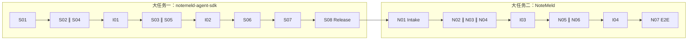

# Note Agent 与插件化个人知识库一期基础

日期：2026-08-24
作者 / Agent：用户 + Codex
状态：Planned
关联对话 / 任务：2026-08-23 至 2026-08-24 NoteMeld 整体目标与架构研讨
关联系统文档：

- ../architecture/2026-08-notemeld-agent-knowledge-runtime-architecture.md
- ../system/current-architecture.md
- ../system/product-rules.md
- ../system/data-model.md
- ../system/api-inventory.md
- ../system/known-pitfalls.md
- 2026-08-17-agent-sdk-single-runtime-cutover.md
- ../../../notemeld-agent-sdk/docs/requirements/2026-08-23-agent-sdk-completion-hardening.md
- ../../../notemeld-agent-sdk/docs/requirements/2026-08-24-stateless-note-agent-foundation.md
- 2026-08-24-desktop-note-agent-plugin-integration.md

## 1. 原始需求

用户希望将 NoteMeld 建设成以 Note 为最小原子的 Agent + 数据库个人知识库，并明确项目分为两个发布边界：

1. notemeld-agent-sdk 核心层：
   - 第一层是完全无业务状态的通用 Agent loop；
   - 第二层在第一层之上提供通用 Note 模型和无业务状态的 Note Agent；
   - Agent 状态外置，不与视频、白板、IM、文档平台等具体业务耦合；
   - SDK 是整个系统能够自运行和恢复的可信基础，不允许被 Agent 自我修改。
2. NoteMeld Application 应用层：
   - 提供桌面 UI、宿主、模型与外部系统适配、插件管理和用户交互；
   - 长期支持多端，但一期只交付桌面端；
   - Agent 可以为 Application 和插件产生升级候选，但一期不自动启用 Application 自升级。

一期必须实现以下闭环：

> 一个 Agent 或外部 Agent 能发现能力，读取个人知识库，通过插件完成任务，把结果写成新的 Note，并保留来源、关系、操作记录和可恢复状态；用户可以在同一台电脑上的另一个 Agent、CLI 或 MCP Client 中继续使用这些内容。

用户同时确认：

- 插件优先采用已有公开标准协议，使其他 AI 平台用户无需定制改造即可使用；
- GitHub/Gitee 作为插件分发源，安装 GitHub/Gitee Release 中的标准插件包；
- 安装时校验 manifest、版本和 hash；
- 一期官方业务插件是“现有全部外部链接转笔记能力”的插件化迁移，不能降低当前覆盖和稳定性；
- 桌面端使用同一个 SQLite 文件，不同模块使用独立表域和独立 migration registry；
- Application 自升级一期只建立安全边界和 candidate 流程；
- 一期不要求复杂内部 Multi-agent Task DAG。

## 2. 背景和问题

- 当前用户是谁：
  - 希望在桌面端维护个人知识库的普通用户；
  - 通过 MCP、CLI 或其他 Agent 使用个人知识的开发者和 AI 工具用户；
  - 发布或安装 NoteMeld 插件的开发者。
- 当前场景是什么：
  - NoteMeld 已能把网页、视频等来源加工为 Note，并已有桌面端、MCP、CLI 和独立 Rust Agent SDK；
  - 现有能力仍主要以内建业务模块存在，通用 Note Agent、标准插件包、公开仓库安装和安全升级边界尚未形成统一闭环。
- 当前痛点是什么：
  - SDK 和 Application 对 Note 的所有权尚未按新目标收敛；
  - 外部链接转 Note 等能力与主应用耦合，无法独立发布、安装和升级；
  - 外部 AI 平台接入可能依赖定制协议，生态复用成本高；
  - Application 自升级缺少 candidate、验证、审批和回滚边界；
  - Note、Agent runtime、插件和审计虽然已有部分基础，但尚未以同一桌面端纵向场景完成验证。
- 为什么现在要做：
  - 当前 SDK 基础能力已经存在，继续新增上层功能前应先稳定 Note Agent 和插件边界；
  - 如果先扩展手机、Web、白板或更多连接器，会继续放大当前业务耦合和数据权威分散问题。

## 3. 目标结果

### 3.1 产品结果

1. 用户在 NoteMeld 桌面端可以提交任一当前受支持的外部链接，并由已安装的官方链接转笔记插件生成可追溯 Note。
2. 同一台电脑上的外部 Agent、CLI 或 MCP Client 可以发现 Note 和插件能力，读取已有 Note，并继续创建或关联 Note。
3. 用户可以从 GitHub/Gitee Release 安装符合 NoteMeld 插件规范的标准插件包；安装和加载失败不会破坏当前应用或知识库。
4. Agent 可以为 NoteMeld Application 或插件产生升级 candidate；一期只保存、验证和展示 candidate，不自动替换正在运行的 Application。

### 3.2 架构结果

1. notemeld-agent-sdk 形成两层稳定边界：
   - L1 Stateless Agent Loop；
   - L2 Stateless Note Agent。
2. L2 拥有产品无关的通用 Note 模型、Note capability 和 Note Agent 行为契约，但不拥有视频、网页、IM、文档平台或 UI 业务逻辑。
3. NoteMeld Application 只负责桌面 UI、宿主生命周期、适配器、插件安装运行、权限交互和现有业务接入。
4. Agent 和 Note Agent 不把业务状态保存在进程内；Session、Turn、Note、版本、来源、关系、插件状态和审计记录全部通过外部 Store 持久化。
5. 同一 SQLite 文件承载一期本地数据，不同领域拥有独立表域和 migration registry；模块不得争用同一个全局迁移版本号。
6. 插件能力使用平台无关 capability schema，并优先通过 MCP 等公开协议对外兼容；平台专属能力通过 adapter 接入。

## 4. 非目标

- 不交付手机端、Web 端或跨设备同步服务。
- 不交付多人 workspace、实时协作或 CRDT。
- 不要求复杂内部 Multi-agent Task DAG 成为一期完成门槛。
- 不允许 Agent 修改、替换或自动升级 notemeld-agent-sdk。
- 不在一期自动启用 Agent 生成的 Application 源码升级。
- 不允许从任意 Git 仓库 clone 后自动执行仓库安装脚本。
- 不承诺一个平台专属 UI、Hook 或私有插件协议能在所有 AI 平台原样运行。
- 不建设中心化插件市场；一期只支持标准 Release 包安装。
- 不把白板、视频解析、IM、文档平台等业务模型放入 L1 Agent loop。
- 不删除现有源码启动、桌面、CLI、MCP、迁移、Wiki、导出或历史 Note 能力。

## 5. 当前系统事实

### 5.1 已有能力

- notemeld-agent-sdk 已是独立 Rust runtime 仓库，拥有 canonical loop、Turn/Event、取消、steer、审批、ToolDriver、ModelDriver、durable runtime、trace、capability registry 和 plugin manifest 基础。
- NoteMeld 通过 Python binding 和 backend/app/agent_host 使用 SDK；Web、Tauri 和 CLI 的 Agent 入口统一为 /api/agent/v1。
- 当前 MCP endpoint 为 http://127.0.0.1:8483/mcp，已提供生成、搜索和读取 Note/Wiki 等能力。
- NoteMeld 当前支持网页以及 Bilibili、YouTube、抖音、快手、视频号等外部链接处理，并包含字幕、下载、转写、截图、网页抓取和降级路径。最终支持基线必须由实施前自动化 inventory 从当前代码和测试中冻结，不能只依赖本文列举。
- 桌面端使用 Tauri v2 + Python backend sidecar；数据目录由 Tauri 注入。
- 当前 SQLite、note_results 文件、Wiki materialization 和 Chroma 共同承载不同数据与投影。

### 5.2 当前差距

- 当前 SDK 系统文档明确把 Note 排除在 SDK 数据模型之外；这与本需求确认的 L2 Stateless Note Agent 新边界冲突。
- 当前链接转 Note 是主应用内建链路，还不是可独立安装、验证和回滚的标准插件。
- 当前 plugin manifest/loader 不等于完整的 Release 下载、hash 校验、安装、进程生命周期和回滚控制面。
- 当前没有可验证的 Application 自升级 candidate 产品流程。
- 当前跨平台公开协议主要是 MCP；不同 AI 平台的 function calling、Skill 和专属 UI 仍需适配边界。

### 5.3 相关已知风险

- MCP 入口必须防止路径穿越和凭证泄漏。
- Capability 必须保持 L0-L3 渐进披露，不能首轮平铺全部插件 schema 或连接所有远端服务。
- Agent Host 不能复制 SDK loop、直接写 Agent Event 或伪造 terminal outcome。
- 同 Session 并发门禁必须以 SQLite 短事务为事实源，不能只靠进程内状态。
- 工具副作用在 effect committed 但结果未 checkpoint 时不能自动重放。
- Note 保存成功后，索引、Wiki、消息或导航失败不能把 Note 本身回写为失败并诱发重复创建。
- 不同 SQLite 模块不得通过同一个 PRAGMA user_version 互相覆盖迁移编号。

## 6. 用户故事

1. 作为桌面端用户，我希望粘贴任一当前受支持的外部链接后仍能稳定生成 Note，以便业务插件化不会损失原有能力。
2. 作为知识库用户，我希望每篇插件生成的 Note 都保留来源、派生关系、插件版本和操作记录，以便追溯其生成过程。
3. 作为外部 Agent 用户，我希望通过标准协议发现并调用 NoteMeld 能力，以便无需为 NoteMeld 编写专属集成。
4. 作为插件使用者，我希望从 GitHub/Gitee Release 安装标准插件包，并在不兼容或校验失败时得到安全错误，以便不破坏本地知识库。
5. 作为插件开发者，我希望发布一个协议稳定、与 NoteMeld UI 解耦的插件，以便同一能力可以被 NoteMeld 和兼容 AI 平台调用。
6. 作为应用维护者，我希望 Agent 生成的 Application 改进先成为可审计 candidate，以便测试、审批和回滚后再决定是否采用。
7. 作为 SDK 维护者，我希望 L1 loop 永远不依赖 Note 或业务模型，L2 Note Agent 永远不依赖具体来源平台，以便底层可以独立验证和发布。

## 7. 验收标准

### 7.1 SDK 分层

1. GIVEN notemeld-agent-sdk workspace，WHEN 执行自动依赖边界检查，THEN L1 Agent loop 不依赖 Note、HTTP、Tauri、FastAPI、视频、网页、IM、Wiki 或插件安装实现。
2. GIVEN L2 Note Agent，WHEN 宿主提供符合契约的 Note Store、Model Driver 和 Tool Driver，THEN 它能在不加载 NoteMeld Application 代码的情况下完成 Note 的发现、读取、创建、更新和关联。
3. GIVEN 相同输入、Store 快照和模型/工具 fixture，WHEN 在支持的 host binding 中执行，THEN L2 产生一致的事件顺序、终态和 Note operation 语义。
4. WHEN Agent 或 Note Agent 进程退出，THEN 所有可恢复业务状态均可从外部 Store 重建，且进程内缓存不成为权威事实源。
5. WHEN Application 自升级 candidate 请求修改 notemeld-agent-sdk 源码、制品或公共契约，THEN 系统拒绝该 candidate，并记录不包含敏感内容的审计原因。

### 7.2 Note 与持久化

6. GIVEN 一个已存在 Note，WHEN Note Agent 创建派生 Note，THEN 新 Note 保留原 Note 或外部来源引用、明确关系、发起主体、插件身份、插件版本和操作记录。
7. GIVEN 同一个 request id 和相同 payload，WHEN请求被重复提交，THEN 返回同一已提交结果且不创建重复 Note。
8. GIVEN 同一个 request id 和不同 payload，WHEN请求被重复提交，THEN 返回可分类 conflict 且不覆盖原结果。
9. GIVEN工具副作用已提交但 checkpoint 未完成，WHEN Runtime 恢复，THEN 该调用进入 needs-attention 或等价状态，不自动重复执行。
10. GIVEN SQLite 中同时存在 Note、Runtime、Plugin 等表域，WHEN任一模块升级 schema，THEN 其他模块的 migration version 和既有数据保持不变。
11. GIVEN FTS、向量索引、Wiki 或 graph 投影损坏，WHEN执行重建，THEN 可以从 Note 权威数据恢复投影，且不丢失 Note、来源和关系。

### 7.3 插件安装与安全

12. GIVEN 一个 GitHub/Gitee Release URL，WHEN用户安装插件，THEN系统只接受符合标准包结构、manifest、兼容版本和内容 hash 的 artifact。
13. WHEN manifest 缺失、版本不兼容、hash 不匹配、依赖不满足或权限被拒绝，THEN安装 fail closed，旧插件版本和现有知识库继续可用。
14. WHEN Release 仓库包含安装脚本，THEN NoteMeld 不因安装流程自动执行该脚本。
15. GIVEN插件已安装，WHEN Agent 发现能力，THEN只通过有界 capability metadata 进行 L0/L1 发现，未选中的插件不被启动或连接。
16. GIVEN插件需要网络、文件、模型或 Note 写权限，WHEN首次执行受保护能力，THEN真实宿主 authority 决定授权；manifest 或模型输出不能自行获得权限。
17. GIVEN插件超时、崩溃或返回非法结果，WHEN宿主终止调用，THEN Agent Turn 得到可分类安全错误，Note authority 和其他插件不被破坏。

### 7.4 公开协议兼容

18. GIVEN支持 MCP 的外部 AI Client，WHEN连接 NoteMeld MCP endpoint，THEN可以发现并调用允许的 Note 和插件能力，无需 NoteMeld 专属协议改造。
19. GIVEN只支持标准 function/tool calling 的模型，WHEN通过 NoteMeld Model/Tool Driver 使用 capability，THEN同一 capability schema 可以被转换和调用，不要求插件实现模型厂商专属业务逻辑。
20. GIVEN第三方插件采用 NoteMeld 支持的公开标准协议，WHEN用户安装或配置该插件，THEN优先使用标准协议 adapter；只有标准无法表达时才允许新增平台专属 adapter。
21. GIVEN第三方插件含平台专属 UI、Hook 或私有 API，WHEN NoteMeld 无对应 adapter，THEN系统明确报告不兼容部分，不宣称完整兼容。

### 7.5 外部链接转 Note 插件

22. GIVEN实施前冻结的当前受支持 URL baseline，WHEN链接能力完成插件化，THEN baseline 中每一类 URL 的成功路径、任务状态、来源、失败分类和既有降级路径均通过等价回归。
23. GIVEN平台存在官方字幕，WHEN生成 Note，THEN继续优先使用官方字幕，避免不必要转写。
24. GIVEN视频下载、音频下载或转写失败且网页信息可用，WHEN插件继续处理，THEN继续按现有产品规则降级为网页抓取并产出可追溯结果。
25. GIVEN链接无效、平台不支持、网络失败或解析结果为空，WHEN任务结束，THEN返回可理解且可恢复的错误，不创建伪成功 Note。
26. GIVEN链接插件成功写入 Note，WHEN后续 Wiki、索引或前端投影失败，THEN Note 成功边界保持不变，失败作为独立诊断记录。

### 7.6 桌面端与外部 Agent

27. GIVEN NoteMeld 桌面 backend 已 ready，WHEN用户通过桌面 UI 调用链接插件，THEN任务具有可理解进度、取消、错误和恢复路径。
28. GIVEN桌面端创建的 Note，WHEN同一台电脑上的 CLI、MCP Client 或外部 Agent 查询，THEN可以读取同一 Note、来源和关系。
29. GIVEN同一 Session 已有活动 Turn，WHEN第二个 Client 并发提交 Turn，THEN一个请求继续执行，另一个收到稳定 session-busy 结果，不产生第二套状态。
30. GIVEN桌面 sidecar 尚未 ready，WHEN UI 尝试发起业务请求，THEN请求被现有初始化门禁阻止。

### 7.7 Application 自升级 candidate

31. GIVEN Agent 发现 Application 或插件改进机会，WHEN生成升级 candidate，THEN candidate 包含目标范围、来源 trace/evidence、变更 artifact、测试结果、风险和回滚信息。
32. WHEN candidate 只修改 NoteMeld Application 或插件且通过安全边界检查，THEN系统可以保存并展示 candidate，但一期不自动替换运行中的 Application。
33. WHEN candidate 未通过测试、试图修改 SDK、缺少来源证据或无法提供回滚信息，THEN candidate 不能进入可批准状态。
34. WHEN用户拒绝或删除 candidate，THEN当前 Application、插件 active version 和知识库保持不变。

## 8. 输入 / 输出样例

### 输入一：外部链接

- 用户在桌面端输入当前支持的视频或网页 URL。
- 系统选择已安装的官方链接转 Note 插件。

### 输出一：生成 Note

- 一篇标准 Note；
- 原始 URL SourceRef；
- 插件 ID 和版本；
- 生成任务、事件和操作记录；
- 适用时包含字幕、转写、截图或网页降级来源；
- 可由同机 MCP Client 查询。

### 输入二：插件安装

- GitHub/Gitee Release artifact URL；
- 用户确认安装请求和权限。

### 输出二：插件安装结果

- 已验证的 manifest、版本、hash 和兼容性；
- 安装状态和 active version；
- 可发现的 capability；
- 安装失败时保留旧版本。

### 输入三：Application 改进

- Agent 根据失败 trace 生成 Application patch candidate。

### 输出三：升级候选

- staged candidate；
- 证据和测试摘要；
- 受影响模块；
- 是否触碰 SDK 禁止边界；
- 回滚说明；
- 不自动启用。

### 反例或失败样例

- 直接 clone 默认分支并执行 install.sh：拒绝。
- 插件 manifest 自报文件系统全权限：仍由宿主 authority 拒绝或请求审批。
- Agent candidate 修改 notemeld-agent-sdk：拒绝。
- URL 插件成功保存 Note 后 Wiki 重建失败：Note 仍为成功，Wiki 单独标记失败。
- 只支持某平台私有 UI 的插件：报告局部不兼容，不伪装成完整支持。

## 9. 约束

- 平台 / 设备：一期只支持 NoteMeld 桌面端，以及同一台电脑上的 CLI、MCP Client 和外部 Agent。
- SDK 边界：L1 通用 loop；L2 通用 Note Agent；业务来源、UI 和安装控制面属于 Application 或插件。
- 状态：Agent 和 Note Agent 无业务进程状态；权威状态外置。
- 数据库：同一个 SQLite 文件，独立表域、迁移 registry 和事务边界。
- 隐私 / 安全：不得在日志、事件、manifest、MCP 响应或 candidate 中泄露 Provider key、Cookie、token、绝对私有路径或原始敏感 payload。
- 插件供应链：仅安装标准 Release artifact；校验 manifest、兼容版本和内容 hash；一期不自动执行第三方安装脚本。
- 兼容性：优先公开标准协议；MCP 是支持该协议的平台的首选外部能力协议；function calling 通过 adapter 映射。
- 现有能力：链接插件化不得降低现有 URL 类型、任务状态、字幕优先、转写、截图、网页抓取和失败降级行为。
- License：插件 manifest 必须声明 license；不兼容或缺失时 fail closed。
- Application 自升级：一期只生成、测试、存储和展示 candidate，不自动激活。
- 核心保护：notemeld-agent-sdk 不接受 Agent 自修改。

## 10. 边界场景

- 空数据：空 URL、空 Note 内容、空插件结果不得形成伪成功。
- 权限拒绝：拒绝后不执行受保护工具，不消费旧 approval。
- 网络失败：Release 下载和 URL 采集失败必须可重试且不留下半安装版本或重复 Note。
- 任务中断：恢复时不能自动重放未确认副作用。
- 旧数据兼容：历史 Note、Conversation、task_id、结果文件、Wiki 和导出继续可读。
- 插件升级：新版本加载失败时保留原 active version；回滚不删除历史 manifest 和审计。
- 协议差异：标准协议不能表达平台专属能力时，明确降级或不兼容。
- 大数据量：本需求不新增具体性能数字；Plan 必须基于当前链接处理和 Note 检索基线建立不回退门槛。
- 桌面启动：sidecar ready 前插件和 Agent 业务请求不得抢跑。
- SQLite 并发：短事务完成幂等和活动 Turn 门禁，模型和网络执行不得长期持有数据库写锁。

## 11. 开放问题

无阻塞问题。以下实现选择进入 Plan/Spec，但不得改变本需求边界：

- 标准插件包的具体目录名、压缩格式和签名扩展；
- L2 Note Model 的具体字段和 ABI 暴露范围；
- 本地进程插件使用 stdio MCP、JSON-RPC 或兼容 transport 的最终组合；
- Application candidate 的 UI 入口和本地 artifact 目录；
- 当前支持 URL baseline 的自动 inventory 生成方式。

## 12. 与系统事实的冲突检查

- 是否和 product-rules.md 冲突：
  - 存在已确认的架构演进。旧规则把 Note/Wiki 等产品能力全部留在 NoteMeld adapter；本需求将“通用 Note 模型和无业务状态 Note Agent”提升到 SDK L2。
  - 不改变本地优先、来源可追溯、MCP、单一 Agent Host、approval、桌面启动和现有业务能力保护规则。
  - 用户确认本需求的新分层优先；实施完成后必须写回 product-rules.md。
- 是否和 data-model.md 字段语义冲突：
  - 当前 Note 权威分散在 note_documents、task result、conversation 和 Wiki 投影；本需求要求建立通用 Note 语义，但不在需求层臆造具体数据库字段。
  - Plan 必须提供旧数据迁移和 task_id 兼容映射。
- 是否和 api-inventory.md 接口语义冲突：
  - 一期保留 /api/agent/v1、/mcp 和现有 response wrapper。
  - 新插件安装、candidate 和 Note capability 接口必须在 Spec 中定义并写回 inventory。
- 是否会重新引入 known-pitfalls.md 中的问题：
  - 禁止第二套 Agent loop、进程内活动状态、无条件工具 schema 平铺、MCP 凭证泄露、副作用自动重放、Note 成功后因投影失败而重复创建、SQLite migration 互相覆盖。
- 是否影响本地数据或线上服务：
  - 影响本地 SQLite schema、插件 artifact 目录和 SDK artifact；一期不新增同步或云端服务。
- 是否影响用户已确认交互：
  - 保留当前桌面链接转 Note 的能力和入口结果；具体插件管理 UI 在后续 Design/Spec 中定义。

## 13. Requirement Quality Gate

- [x] 保留用户原始意图和关键确认。
- [x] 写清用户、场景、痛点和业务价值。
- [x] 目标描述产品与架构结果，没有在需求层固定未确认字段。
- [x] 明确一期非目标。
- [x] 当前系统事实来自代码、系统文档或用户确认。
- [x] 验收标准使用可观察的 GIVEN/WHEN/THEN。
- [x] 覆盖正常、失败、恢复、权限、供应链和兼容场景。
- [x] 写清平台、隐私、安全、兼容、数据库和 License 约束。
- [x] 检查 product-rules、data-model、api-inventory 和 known-pitfalls。
- [x] 无阻塞 Plan/Spec 的开放问题。
- [x] 未写入密钥、token、隐私数据或原始用户素材。

质量门禁结论：内容已满足 Ready for Plan 条件，用户已于 2026-08-24 确认本文件。

## 14. 两个大任务与文档交接

本总需求不再由一个跨仓库执行计划同时修改两个仓库，而是拆成两个可独立验收的 child requirement：

| 顺序 | 大任务 | 仓库 | Requirement / Plan / Spec / Test / Goals |
| --- | --- | --- | --- |
| 1 | Stateless Note Agent 与公开插件契约基础 | `notemeld-agent-sdk` | `docs/requirements/2026-08-24-stateless-note-agent-foundation.md` 及其 `docs/superpowers/` 文档 |
| 2 | NoteMeld 桌面 Note Agent 与插件集成 | `NoteMeld` | `docs/requirements/2026-08-24-desktop-note-agent-plugin-integration.md` 及其 `docs/superpowers/` 文档 |

硬门禁：SDK S08 必须通过严格发布验收并交付固定 version/schema/ABI/commit/artifact SHA-256、兼容矩阵和 handoff，NoteMeld 才可开始 N01 代码实现。NoteMeld 的文档和只读 baseline 可提前准备，但不得依赖 SDK 开发快照。

整体完成条件：SDK child requirement 与 NoteMeld child requirement 均为 Implemented，且 NoteMeld N07 的真实桌面/MCP/CLI/插件纵向场景通过。任一 child 未完成时，本 P7 保持 Planned。

## 15. 总体执行 DAG

详细并行所有权、验收命令和每个子目标的 `/goal` 提示词，以两个 child requirement 的 Plan/Spec/Goal 手册为准。跨仓库总控可直接使用 `../superpowers/goals/2026-08-24-note-agent-plugin-foundation-master-prompt.md`。
