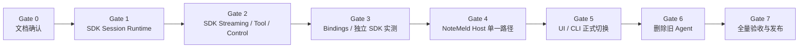

# Agent SDK 单一运行时与 NoteMeld 正式切换实施计划

日期：2026-08-17
状态：Draft for Review（仅文档，用户确认后才能执行）
Canonical Requirement：`docs/requirements/2026-08-17-agent-sdk-single-runtime-cutover.md`
Change Spec：`docs/system/change-spec-agent-sdk-single-runtime-cutover.md`
目标架构：`docs/superpowers/specs/2026-08-17-agent-sdk-single-runtime-architecture.md`
执行规格：`docs/superpowers/specs/2026-08-17-agent-sdk-single-runtime-execution.md`

## 1. 计划目标

把已经独立出来的 `/Users/hehejie/ai/notemeld-agent-sdk` 强化为唯一 Agent 行为事实源，再让 `/Users/hehejie/ai/NoteMeld` 只通过正式 SDK artifact 接入。最终删除 NoteMeld 内部 Python Agent loop、compat、feature flag 和重复 Turn 状态机，同时保留历史业务数据以及 Note、Wiki、白板、MCP、上传、迁移、源码、桌面和 CLI 能力。

本计划不是从零重做 SDK。现有 Rust crates、AgentEvent、C ABI、bindings、artifact CI、Ollama launcher 和 NoteMeld Agent v1 骨架都作为基线复用。

## 2. 执行原则

- 用户确认本 Plan 和执行 Spec 前，不开始任何代码修改。
- 两个仓库分别使用隔离工作树/分支，任务提交不得跨仓库混合。
- 每个 Task 执行 RED → 最小 GREEN → focused regression → 自审 → 独立提交。
- SDK Gate 未通过前，不改 NoteMeld 正式 consumer。
- 不使用 Python legacy Agent 作为运行时 fallback；旧实现只在删除前作为只读行为参考。
- SDK 是状态和事件语义所有者；NoteMeld Store Adapter 是物理事务执行者。
- 任何真实 Provider、工具或存储异常都必须映射为稳定安全错误，不能跨 FFI/SSE 泄漏原 payload。
- 不删除历史 Conversation、Message、Note、Wiki、Whiteboard、Provider、Model 或 Usage 数据。

## 3. 交付 Gate



| Gate | 包含任务 | 必须满足的结果 |
| --- | --- | --- |
| Gate 0 | 文档 | Requirement、架构、Plan、Execution Spec 经用户确认。 |
| Gate 1 | Task 1–3 | SDK 从 Store 读取真实历史，Session/Turn/幂等成为正式 Runtime 的组成部分。 |
| Gate 2 | Task 4–7 | 真流式、Capability/Tool、Cancel/Steer/Approval 全部由 SDK 控制。 |
| Gate 3 | Task 8–9 | ABI/bindings 同步；独立 Ollama 至少三轮续聊并通过工具/取消实测。 |
| Gate 4 | Task 10–13 | NoteMeld 使用进程级 SDK Host，存储/模型/工具/API/SSE 全部接通。 |
| Gate 5 | Task 14–16 | UI 与产品 CLI 只走 Agent v1，并共享同一 Conversation。 |
| Gate 6 | Task 17 | 旧 Python Agent/compat/flags/重复状态机删除，产品工具改为 Adapter。 |
| Gate 7 | Task 18–19 | 打包、全量回归、真实纵向和系统文档全部完成。 |

## 4. Task 清单

### Task 1：冻结当前双仓库基线与目标协议版本

依赖：Gate 0。

涉及文件：

- SDK：`Cargo.toml`、`crates/agent-events/src/lib.rs`、`bindings/abi-v1.json`、`schemas/*.json`、`README.md`。
- NoteMeld：只新增/修改契约测试文档，不改生产代码。
- 测试：SDK workspace tests、Python ABI tests、NoteMeld `backend/tests/agent_host/`。

执行：

- [ ] 记录两个仓库 commit、工具链、现有测试数量和真实失败点。
- [ ] 记录 NoteMeld 内嵌 `agent-sdk/` 与独立仓库的文件/commit 差异，冻结“独立仓库唯一源码”的删除清单。
- [ ] 新增失败契约，证明当前 FFI 使用空历史、Steer unsupported、Approval 无执行链、NoteMeld SSE 非 live。
- [ ] 固定目标 SDK `0.2.0`、AgentEvent schema `1`、native ABI manifest `2`；旧 ABI 不承诺运行兼容。
- [ ] 明确 v1 AgentEvent 能否无破坏地表达目标事件；若需要新增字段只允许 optional，改义才升级 schema。
- [ ] 不在本 Task 修复生产行为。

完成条件：失败证据准确，目标版本边界固定，现有基线测试结果可复现。

提交：`test(agent-sdk): freeze single-runtime migration baseline`。

### Task 2：把 Session/Turn/Store 组合进正式 SDK Runtime

依赖：Task 1。

涉及文件：

- SDK：`crates/agent-core/src/lib.rs`、`loop.rs`、新增 `runtime.rs`。
- SDK：`crates/agent-session/src/lib.rs`。
- SDK：`crates/agent-storage/src/lib.rs`。
- 测试：新增 `crates/agent-core/tests/session_runtime.rs`、扩展 session/storage tests。

执行：

- [ ] 先写 RED：同 Session 第二个 active Turn 被拒绝、相同 request_id exact replay、不同 payload 冲突、终态释放 lease、Store 失败不执行模型。
- [ ] 新增 session-oriented `AgentRuntime::start_turn()`，由 SDK 调用 Store 开启 durable Turn，不再由 Host 先制造状态。
- [ ] 将 `TurnCoordinator` 从独立内存工具变成 Runtime 依赖；Store 是幂等和跨进程最终权威。
- [ ] 定义 `AgentStore` async trait：begin/load history/append event/checkpoint/finish/replay/recover。
- [ ] reference SQLite 实现只服务独立 SDK/harness；NoteMeld 使用 Host Store Adapter。
- [ ] 保证每 Turn 恰好一个 terminal event，状态转换只经过 SDK state machine。

完成条件：Runtime、Session、Store 不再是三个未组合模块；并发/幂等/失败边界测试通过。

提交：`feat(agent-sdk): compose durable session runtime`。

### Task 3：实现 SDK Context Engine 与真正多轮历史

依赖：Task 2。

涉及文件：

- SDK：`crates/agent-core/src/context.rs`、新增 `history.rs`、`context_policy.rs`。
- SDK：`crates/agent-model/src/lib.rs`。
- SDK schemas：Turn/Message/Context DTO。
- 测试：`crates/agent-core/tests/history_context.rs`。

执行：

- [ ] 先写 RED：第二/第三 Turn 能看到前序 user/assistant/tool 消息；空历史不得伪装续聊。
- [ ] Host Store 只把产品消息映射成通用 `AgentMessage`；NoteMeld UI-only 类型在 Adapter 层排除。
- [ ] SDK 统一验证 role/content/tool_calls/tool_call_id，并保证 assistant tool call 与 tool result 成组。
- [ ] 引入 `ModelContextPolicy`：context window、output reserve、safety reserve、图像预算和截断诊断。
- [ ] 只裁剪发送给模型的副本，不修改 Store 中的历史。
- [ ] Turn input 的 attachments/context_refs 使用版本化 DTO；具体引用 authority 仍由 Host 解析。

完成条件：reference Store 连续三 Turn conformance 通过，4K 窗口裁剪不拆工具对。

提交：`feat(agent-sdk): add authoritative conversation context`。

### Task 4：实现真正异步流式 ModelDriver 协议

依赖：Task 2–3。

涉及文件：

- SDK：`crates/agent-model/src/lib.rs`。
- SDK：`crates/agent-ffi/src/lib.rs`、ABI renderer/manifest。
- Python binding：`bindings/python/notemeld_agent_sdk/runtime.py`。
- Swift/Kotlin/Harmony bindings 对应 callback bridge。
- 测试：model stream、ABI、Python native smoke。

执行：

- [ ] 先写 RED：Driver 完成前必须收到多个 delta；取消后不接受 late chunk；chunk sink 失败产生稳定终态。
- [ ] ABI v2 增加 `emit_driver_event(call_id,event_json)`，最终 completion 仍只调用一次。
- [ ] 支持 `model.content_delta`、tool-call delta/final、usage 和 finish reason。
- [ ] 对 call_id 做 pending/completed/late 有界状态管理，保持 callback release 和 free race 安全。
- [ ] 不允许 Driver 把所有 chunks 塞进最终 JSON 冒充实时流式。
- [ ] 更新所有 binding 的线程和生命周期契约。

完成条件：真实 native callback 在模型完成前产生 `message.delta`，取消/late/duplicate 行为稳定。

提交：`feat(agent-sdk): stream driver events across abi`。

### Task 5：把 L0–L3 Capability 与 Tool Scheduler 组合进 Agent Loop

依赖：Task 3–4。

涉及文件：

- SDK：`crates/agent-capabilities/src/lib.rs`。
- SDK：`crates/agent-tools/src/lib.rs`。
- SDK：`crates/agent-core/src/loop.rs`、新增 `capability_tools.rs`。
- 测试：capability discovery、tool round、oracle conformance。

执行：

- [ ] 先写 RED：首轮只暴露三个元工具；L0 上限、L1 summary、L2 schema、L3 invoke 严格生效。
- [ ] SDK 内置 `capability_discover/describe/invoke` 元工具，Host 只注册 manifest/provider。
- [ ] `ModelRequest` 显式携带当前允许的 ToolDescriptor。
- [ ] ToolDescriptor 增加 serial/risk/approval metadata，参数必须为 JSON object。
- [ ] 保持并发工具结果按原 call 顺序回填，实时 progress 按实际到达发出。
- [ ] use_wiki/capability policy 由 Host 解析后传 SDK allowlist，SDK执行双重门禁。

完成条件：SDK fake registry 完整跑通 discover→describe→invoke→model continuation。

提交：`feat(agent-sdk): integrate progressive capabilities into loop`。

### Task 6：实现 SDK Control Plane：Cancel 与 Steer

依赖：Task 2、4、5。

涉及文件：

- SDK：`crates/agent-core/src/runtime.rs`、`loop.rs`。
- SDK：`crates/agent-session/src/lib.rs`。
- SDK：`crates/agent-ffi/src/lib.rs`、bindings。
- 测试：`crates/agent-core/tests/control_plane.rs`、ABI contract。

执行：

- [ ] 先写确定性 RED：cancel 与 model/tool completion race；steer 在下一安全点进入当前 Turn；terminal 后 steer 返回 typed error。
- [ ] CancelToken 贯穿 model、tool、approval wait 和 Store checkpoint。
- [ ] Steer 使用有界输入通道；只在外部调用返回后、下一次模型调用前注入 user steer message。
- [ ] 同一 steer command 使用 command_id 幂等，不重复注入。
- [ ] 客户端断开不等于 cancel。
- [ ] 删除 FFI `FFI_UNSUPPORTED` 的 steer 占位行为。

完成条件：Cancel/Steer 作用于同一 native Turn，race 测试只有一个终态。

提交：`feat(agent-sdk): add native turn control plane`。

### Task 7：实现审批状态机与风险策略接口

依赖：Task 5–6。

涉及文件：

- SDK：新增 `crates/agent-approval/`，只依赖 event/session/tool contract，不依赖任何 NoteMeld 产品模块。
- SDK：`agent-events` approval payload、`agent-session` 状态、`agent-core` loop。
- SDK：FFI/bindings approval resolve API。
- 测试：safe/interactive/deny/timeout/cancel/replay。

执行：

- [ ] 先写 RED：危险工具进入 waiting_approval，safe 工具无需等待，拒绝/超时不执行副作用。
- [ ] 定义 `ToolRisk`、`ApprovalPolicy`、`ApprovalDecision` 和不可自动批准级别。
- [ ] `interactive` 发 `approval.required` 并等待；`deny` 写受控 tool result；`allow_safe` 只批准 policy 允许的动作。
- [ ] resolve 使用 approval_id + decision_id 幂等；错误 Turn/过期请求拒绝。
- [ ] approval timeout 默认五分钟，取消优先于超时。
- [ ] 审批事件只包含 action digest、risk、summary、deadline，不包含原始秘密参数。

完成条件：审批状态机、工具副作用边界和事件契约通过。

提交：`feat(agent-sdk): enforce tool approval lifecycle`。

### Task 8：发布 ABI v2 并同步全部语言 Binding

依赖：Task 2–7。

涉及文件：

- SDK：`bindings/abi-v2.json`、generated header/semantic UDL。
- Python：runtime API、typing、wheel tests。
- Swift/Kotlin/Harmony：wrapper 与现有 harness。
- CI/build scripts/artifact validator。

执行：

- [ ] manifest 驱动生成全部函数、callback、ownership/threading/error 契约。
- [ ] Binding 只翻译类型，不保存另一份 Session/Turn 状态机。
- [ ] 覆盖 runtime close、callback release、driver completion、stream event、cancel、steer、approval 和 stale handle。
- [ ] Python 提供同步 façade 和 asyncio-friendly event iteration；不得阻塞调用方 event loop。
- [ ] Android/Harmony target compile/run 只能由真实工具链/设备或 CI 声称通过。
- [ ] artifact verifier 对 ABI/version/architecture/license fail-closed。

完成条件：Rust/Python/Swift 本机 smoke 与所有可用 target gate 通过，移动 target 未执行项如实记录。

提交：`feat(agent-sdk): publish session runtime abi v2`。

### Task 9：加强独立 SDK CLI 与本地 Ollama 实测

依赖：Task 3–8。

涉及文件：

- SDK Python：`notemeld_agent_sdk/ollama_cli.py`。
- SDK scripts：`scripts/ollama-agent.sh`、`scripts/test-sdk.sh`。
- SDK tests：CLI unit/native integration。
- README 与本地验证文档。

执行：

- [ ] 默认不带参数可启动，自动检测本机 Ollama 和已安装模型；默认模型不存在时给出可操作提示。
- [ ] 交互 Session 使用 reference Store，真正保留多轮历史。
- [ ] 支持 `/model`、`/models`、`/new`、`/session`、`/cancel`、`/exit` 和 `--json`。
- [ ] 本地真实执行至少三轮上下文记忆、一次模型切换、一次 cancel；工具使用 fake/local safe capability 验证。
- [ ] Shell 封装 Python path/native library/Ollama service，不要求用户手动建虚拟环境。

完成条件：用户在 SDK 仓库只运行一个 shell 即可实际评估 Agent，不启动 NoteMeld。

提交：`feat(cli): exercise durable sdk sessions with ollama`。

### Task 10：建立 NoteMeld 进程级 AgentSdkHost

依赖：Gate 3。

涉及文件：

- NoteMeld：重构 `backend/app/agent_host/runtime.py`、`native_executor.py`。
- 新增 `backend/app/agent_host/host.py`、`handles.py`。
- 修改 FastAPI lifespan：`backend/app/__init__.py`、`backend/main.py`。
- 测试：loader、lifecycle、version mismatch、shutdown/recovery。

执行：

- [ ] 先写 RED：Runtime 进程内只创建一次；并行 session 共用；shutdown 不遗留 callback/worker。
- [ ] 正式环境只加载安装 wheel/native artifact；开发环境必须显式 SDK root/artifact。
- [ ] 启动校验 SDK 0.2、ABI 2、Agent schema 1；不匹配 fail-closed。
- [ ] Host 保存 `turn_id -> native handle/token`，供 control API 使用。
- [ ] 移除 per-turn daemon thread + 30 秒 wait 作为执行模型。
- [ ] 启动时通过 Store 恢复/标记非终态 interrupted。

完成条件：Host 生命周期与 FastAPI 生命周期一致，模型慢于 30 秒不会被错误关闭。

提交：`refactor(agent-host): own one native sdk runtime`。

### Task 11：实现 NoteMeld Production Store Adapter 与 Conversation Projection

依赖：Task 10。

涉及文件：

- `backend/app/agent_host/drivers/storage.py`。
- `backend/app/services/agent_store.py`。
- `backend/app/db/models/agent.py`、schema ensure/migration。
- `backend/app/services/conversation_store.py`。
- 测试：fresh/legacy DB、idempotency、event replay、projection、failure atomicity。

执行：

- [ ] Store Adapter 实现 SDK `begin_turn/load_history/append_event/checkpoint/finish/replay/recover`。
- [ ] begin_turn 同一事务创建/replay Turn、user message、assistant placeholder。
- [ ] message/tool/terminal projection 使用 SDK message_id/call_id 幂等 upsert。
- [ ] event envelope 不得再次嵌套进 payload；sequence 从 1 严格连续。
- [ ] delta 按 256 字符/250ms/边界事件批量 checkpoint；persist commit 后才 live publish。
- [ ] 迁移现有 agent 表但不删除历史业务表；过渡期 Agent rows 保留并标识 schema version。

完成条件：断电/异常测试不存在“终态无事件”“事件无 Turn”“重复消息”。

提交：`feat(agent-host): adapt durable sdk storage to conversations`。

### Task 12：接入 NoteMeld Model 与 Capability/Tool Driver

依赖：Task 10–11。

涉及文件：

- `backend/app/agent_host/drivers/model.py`、`tools.py`。
- `backend/app/agent/capability_catalog.py`、builtin/memory/workspace/skill/mcp/long-task modules。
- `backend/app/ai/` 仅做必要 adapter 调整。
- 测试：driver payload、真实 chunk、tool progress、policy、redaction。

执行：

- [ ] 正确读取 FFI v2 `payload`，传入历史、tools、model descriptor 和 CancellationToken。
- [ ] 将 `app.ai.Models.stream()` 的 delta/tool/usage 实时发送给 native call_id。
- [ ] 模型选择由 NoteMeld Product Policy 完成，SDK只消费实际 descriptor。
- [ ] 将现有业务能力注册为 CapabilityProvider，不再继承旧 AgentTool/AbortSignal。
- [ ] use_wiki=false、MCP enabled、context authority 和 credential redaction 保持硬边界。
- [ ] Tool progress、cancel、safe error 全部映射到 SDK contract。

完成条件：真实 fake/本地 driver 完成 model→capability→tool→model Turn，旧 core 未参与。

提交：`feat(agent-host): bridge product drivers to sdk runtime`。

### Task 13：完成 Agent v1 API、Live SSE、Control 和全局模型偏好

依赖：Task 10–12。

涉及文件：

- `backend/app/routers/agent.py`。
- `backend/app/agent_host/event_broker.py`、`preferences.py`、approval adapter。
- `backend/app/db/models/agent.py`。
- `backend/tests/agent_host/test_agent_api.py` 等。

执行：

- [ ] 所有普通 JSON 使用 `{code,msg,data}`；SSE 直接发送完整 AgentEvent envelope。
- [ ] events endpoint 先回放到 high-water mark，再加入 live broker，以 sequence 去重，终态后关闭。
- [ ] cancel/steer/approval 必须通过 `AgentSdkHost` 调 native handle。
- [ ] start_turn 返回 turn_id、user_message_id、assistant_message_id、events_url、replayed。
- [ ] 全局模型偏好保存 provider/model 对和有序 fallback；Turn override 优先。
- [ ] 所有 mutation/stream 复用桌面 session token 与安全 origin 边界。

完成条件：API contract、SSE reconnect、control、preference、security tests 通过。

提交：`feat(api): complete single-runtime agent v1`。

### Task 14：将 ChatComposer 正式迁移到服务器权威事件和消息

依赖：Task 13。

涉及文件：

- `frontend/src/services/agent.ts`。
- `frontend/src/store/taskStore/agentEventReducer.ts`、conversation merge。
- `frontend/src/pages/HomePage/components/ChatComposer.tsx`、message renderer、approval UI。
- 前端 contract/component tests。

执行：

- [ ] submit 只发一个 start_turn；不调用 Conversation API 持久化同一 user/assistant/tool 消息。
- [ ] optimistic message 仅是临时投影，并使用服务器 message ids 对账。
- [ ] SSE 自动携带 session token，断线按 last sequence 重连。
- [ ] reducer 幂等处理 delta/tool/approval/usage/terminal/unknown event。
- [ ] terminal 后 reload Conversation，移除重复 transient projection。
- [ ] 无模型、session busy、runtime unavailable、approval/cancel/steer 提供明确交互。

完成条件：UI 单元/契约/build 通过，刷新可恢复 CLI 或 UI 创建的同一消息。

提交：`feat(frontend): consume authoritative sdk agent turns`。

### Task 15：实现正式 `notemeld agent` 产品 CLI

依赖：Task 13。

涉及文件：

- NoteMeld：加强现有薄 HTTP 客户端 `scripts/notemeld-agent.py`，并接入 `scripts/notemeld`、`scripts/notemeld.ps1`、installer；不在 SDK 仓库加入 NoteMeld 产品协议客户端。
- CLI contract 和 NoteMeld cross-entry E2E。

执行：

- [ ] CLI 只调用 NoteMeld Agent v1，不直接打开 SQLite或执行另一套 loop。
- [ ] 支持 REPL、one-shot、text/json/jsonl、`/model`、`/new`、`/resume`、`/sessions`、cancel。
- [ ] JSON/JSONL stdout 只含协议输出；日志和提示写 stderr。
- [ ] `/model` 读取/更新全局 provider/model + fallback。
- [ ] UI 新会话 CLI 可续聊；CLI 新会话 UI 刷新可见。
- [ ] SDK 独立 Ollama CLI 与产品 CLI 名称/帮助明确区分。

完成条件：CLI contract、退出码、stdout/stderr 和 UI↔CLI E2E 通过。

提交：`feat(cli): connect notemeld to shared sdk host`。

### Task 16：统一源码、桌面和 CLI Host 生命周期

依赖：Task 10、13、15。

涉及文件：

- `scripts/notemeld`、PowerShell、`run_notemeld.sh`。
- `backend/app/core/agent_runtime_descriptor.py`。
- `desktop/src-tauri/src/lib.rs`、Tauri config。
- runtime/desktop/packaging tests。

执行：

- [ ] 使用 mode 0600、原子写的 runtime descriptor，含 pid/base_url/token/sdk/abi/schema/data_root。
- [ ] 源码、安装桌面和 CLI 发现/复用同一兼容 Host。
- [ ] 应用启动表示 Host 与 CLI 客户端可立即使用，不自动弹终端窗口。
- [ ] 桌面退出不终止仍有 CLI Turn/长任务的 Host；`notemeld stop` 明确停止。
- [ ] stale/incompatible descriptor 安全清理，不连接错误数据目录。
- [ ] 保留现有 start/stop/logs/doctor/update/uninstall 行为。

完成条件：source/desktop/CLI lifecycle contracts 通过。

提交：`feat(runtime): supervise one agent host for all entries`。

### Task 17：删除旧 Python Agent 执行逻辑

依赖：Gate 5 全部通过。

涉及文件：

- 删除 `backend/app/agent/core/`。
- 删除/重写 `backend/app/agent/agent_service.py`、`sse_bridge.py`、`chat_adapter.py` 旧执行职责。
- 删除 `backend/app/agent_host/compat.py`。
- 修改 `backend/app/routers/chat.py`，移除 `/chat/free*` Agent 兼容执行入口。
- 删除旧 feature flags/rollback env 与对应测试。
- 保留并重构 product capability modules。

执行：

- [ ] 先建立生产 import zero contract，当前旧 import 必须 RED。
- [ ] 将 builtin/memory/workspace/skill/MCP/long-task 从旧 AgentTool DTO 改为 CapabilityProvider adapter。
- [ ] 新 UI/CLI/MCP/内部 caller 搜索确认不再调用旧 free-chat Agent endpoint。
- [ ] 删除 Python loop/message/state/event/signal/tool/hook 和 oracle runtime tests。
- [ ] 保留跨语言 conformance fixtures在 SDK，不依赖旧 Python运行。
- [ ] 删除 `AGENT_CHAT_ENABLED`、`NOTEMELD_AGENT_MODE=python-oracle` 及静默 fallback。

完成条件：生产代码和运行配置不再存在第二套 Agent；非 Agent 产品能力回归通过。

提交：`refactor(agent): remove legacy python runtime`。

### Task 18：打包 SDK artifact、Python SDK 和桌面产物

依赖：Task 8–17。

涉及文件：

- SDK build scripts、wheel、artifact manifest/workflow。
- NoteMeld `backend/requirements.txt` 或 wheel install 输入。
- PyInstaller spec、macOS/Windows build scripts、Tauri resources。
- 独立 SDK 仓库新增 `.github/workflows/agent-sdk.yml`；NoteMeld 删除内嵌 `agent-sdk/` 和其本地构建 workflow，更新 `release.yml` 为下载/校验 artifact。

执行：

- [ ] NoteMeld 正式构建只消费 SDK 0.2 已验证 artifact，不导入外部源码目录。
- [ ] 构建本机 dylib + Python wheel，clean environment native smoke。
- [ ] PyInstaller 收集 Python binding、native library、ABI/schema/license manifest。
- [ ] Desktop release job 必须消费相同 target SDK artifact 并执行 fake turn。
- [ ] SDK artifacts继续覆盖 macOS/Windows/Linux/iOS/Android/Harmony；未真实 target 运行不得声称通过。
- [ ] artifact validator 保持 closed-world、architecture、wheel/ZIP/ar 和 checksum gate。
- [ ] 对比并迁移 NoteMeld 内嵌 SDK 中仍有价值的脚本/测试后，删除整个 `NoteMeld/agent-sdk/`；生产、CI、文档零路径引用。

完成条件：本机 SDK artifact 和 NoteMeld packaged Host smoke 通过，CI 矩阵配置 fail-closed。

提交：`build(agent): ship the single sdk runtime`。

### Task 19：全量验收、真实纵向测试和文档写回

依赖：Task 1–18。

涉及文件：

- `docs/system/current-architecture.md`、product rules、data model、API inventory、known pitfalls、changelog。
- `docs/superpowers/tests/2026-08-17-agent-sdk-single-runtime-cutover.md`。
- `scripts/run_core_regression.sh`。

执行：

- [ ] SDK workspace fmt/clippy/tests、bindings、Ollama 真三轮、artifact verification。
- [ ] NoteMeld backend focused/full tests、compileall、frontend contracts/build、desktop tests、core regression。
- [ ] UI 创建会话 → CLI 续聊 → UI 刷新；CLI 创建 → UI 续聊。
- [ ] 真实 cancel、steer、tool progress、approval、SSE reconnect、runtime restart interrupted。
- [ ] 检查生产 import/flags/endpoints，确认 legacy 为零。
- [ ] 历史 Conversation/Note/Wiki/Whiteboard/Provider/Model 数据读取回归。
- [ ] 只在全部强制证据通过后把 Requirement 改为 Implemented。

完成条件：所有 AC 有命令、结果和失败说明；未执行平台清楚标记，不虚报。

提交：`docs(agent): verify single sdk runtime cutover`。

## 5. 依赖顺序

```text
Task 1
  -> Task 2 -> Task 3
  -> Task 4
  -> Task 5 -> Task 6 -> Task 7
  -> Task 8 -> Task 9
  -> Task 10 -> Task 11 -> Task 12 -> Task 13
  -> Task 14 + Task 15
  -> Task 16
  -> Task 17
  -> Task 18
  -> Task 19
```

Task 14 与 Task 15 可在 Task 13 通过后并行；其余任务按顺序执行。旧逻辑删除 Task 17 不得提前。

## 6. 验收标准映射

| Requirement AC | 主要任务 |
| --- | --- |
| AC1 SDK 唯一运行时 | 2–8、17 |
| AC2 UI/CLI 真历史续聊 | 3、11、14、15 |
| AC3 实时事件和唯一终态 | 4、11、13、14 |
| AC4 Capability/Tool | 5、7、12 |
| AC5 Approval | 7、12–15 |
| AC6 Cancel/Steer | 6、10、13–15 |
| AC7 Replay + Live SSE | 11、13、14–15 |
| AC8 request_id 幂等 | 2、11、13 |
| AC9 全局模型与 fallback | 12–15 |
| AC10 SDK 独立实测 | 3–9 |
| AC11 SDK fail-closed | 8、10、16、18 |
| AC12 历史数据和非 Agent 能力 | 11、17–19 |

## 7. 回滚点

- Gate 1–3：SDK 尚未接生产；回滚 SDK 分支即可。
- Gate 4：NoteMeld consumer 尚未切换；整体回滚 Host 分支，不在单 Turn 内切换 runtime。
- Gate 5：若 UI/CLI 纵向失败，停止发布并整体回退到切换前代码版本；不保留动态 legacy fallback。
- Gate 6 后：使用 Git release/commit 整体回退；新增表和历史消息保留，不做 destructive rollback。
- 任何 Gate 都不得通过清空用户数据库完成回滚。

## 8. Definition of Done

- SDK 是唯一 Agent loop/Session/Turn/Event/Tool/Control/Approval 实现和唯一 SDK 源码仓库；NoteMeld 不再内嵌 `agent-sdk/`。
- 独立 SDK Ollama CLI 真正保留至少三轮历史。
- UI 与 `notemeld agent` 新建/续聊同一 Conversation，无重复消息。
- Model/Tool/Storage 全部经 SDK Driver/Store contract。
- Live SSE、sequence replay、cancel、steer、approval、idempotency 和 interrupted 恢复有自动化与纵向证据。
- 生产代码无 `backend/app/agent/core`、compat、legacy feature flag 或 Python rollback。
- SDK wheel/native artifact 和 NoteMeld packaged Host 可加载并完成 fake Turn。
- 历史知识数据与非 Agent 核心入口回归通过。
- Harbor 仍是下一份独立 Requirement，不进入本计划。
