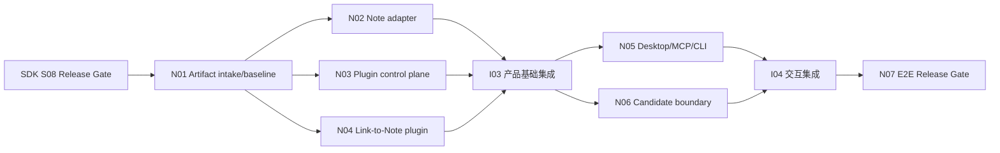

# NoteMeld 桌面 Note Agent 与插件集成计划

日期：2026-08-24
状态：Planned
Canonical requirement：`../../requirements/2026-08-24-desktop-note-agent-plugin-integration.md`

## 1. SDK 硬前置

代码实现开始条件：SDK S08 的测试文档结论明确为通过，并提供固定 version/schema/ABI/commit/artifact SHA-256/compatibility matrix/handoff。未满足时只允许完善本仓库文档和运行只读 baseline。

## 2. Goal 清单

| ID | Goal | 主要产物 | 前置 | 可并行对象 |
| --- | --- | --- | --- | --- |
| N01 | SDK artifact intake 与产品 baseline 冻结 | artifact pin/loader gate、URL/API/DB baseline、adapter contract | SDK S08 | 无，必须最先 |
| N02 | NoteMeld Note Store adapter | task_id 映射、Note/provenance/relation/operation、migration isolation | N01 | N03、N04 |
| N03 | 插件安装与运行控制面 | Release downloader、staging verifier、immutable versions、authority、UI/API | N01 | N02、N04 |
| N04 | 官方链接转 Note 插件 | 全量链接能力迁移、独立 package、baseline regression | N01 | N02、N03 |
| N05 | 桌面/MCP/CLI/外部 Agent 闭环 | 同一 capability/Note authority、UI/Host/transport 集成 | I03 | N06 |
| N06 | Application/plugin candidate 安全边界 | candidate 存储、验证、展示、SDK deny rule、无自动激活 | I03 | N05 |
| N07 | 全链路验收与发布收口 | I04、回归、真实桌面/MCP、打包、文档和总需求关闭证据 | N05、N06 | 无，必须最后 |

I03 集成 N02/N03/N04；I04 集成 N05/N06。集成点解决 router 注册、DB migration 顺序、前端导航、打包资源和共享 schema，不新增路线外功能。

## 3. 依赖图



## 4. 并行规则

### Wave A：N02/N03/N04 并行

- N02 独占 `agent_host` Note adapter、Note/provenance/operation DB schema 和相关 tests。
- N03 独占 plugin control-plane service/router/schema、安装目录、设置页和 installer tests。
- N04 独占 official link plugin package、collector/downloader 迁移和 URL baseline tests。
- 共享 `app/__init__.py`、database init、frontend route/nav、packaging manifest、API inventory 由 I03 集成；并行 Goal 只提交最小 seam 或清晰冲突说明。

### Wave B：N05/N06 并行

- N05 独占 Agent Host/MCP/CLI/桌面纵向接入和 capability UI。
- N06 独占 candidate domain/service/router/storage/UI 与 SDK deny tests。
- 共享 router registration、设置导航和 migration bootstrap 由 I04 集成。

### 必须串行

- SDK S08 → N01 → Wave A → I03 → Wave B → I04 → N07。
- 官方插件不得在 N03 contract 未经 I03 集成前作为生产 active version。
- N07 不得在任何 focused gate/真实纵向证据缺失时标记完成。

## 5. Goal 工作纪律

- 每个并行 Goal 使用独立 linked worktree/分支，不跨仓库提交，不清理用户已有 `.agents/skills` 删除。
- 修改前后检查 NoteMeld `git status`；不把 SDK artifact 生成物提交进源码，除非 packaging 规范明确要求。
- 测试必须覆盖失败/恢复/权限/供应链，不以 UI mock 冒充真实 Host 或 MCP 纵向验证。
- 每个 Goal 更新 Test evidence 的对应行，提交时列出 commit、命令/计数、共享文件和遗留风险。

## 6. 最终验证

```bash
python3 -m compileall backend/app
pytest backend/tests
(cd frontend && corepack pnpm test:contracts)
(cd frontend && corepack pnpm build)
scripts/run_core_regression.sh
```

另需真实运行：固定 SDK artifact loader、GitHub/Gitee Release fixture、链接 baseline、桌面 sidecar/UI、CLI、外部 MCP Client、plugin rollback、candidate SDK boundary deny 和同 SQLite migration isolation。
