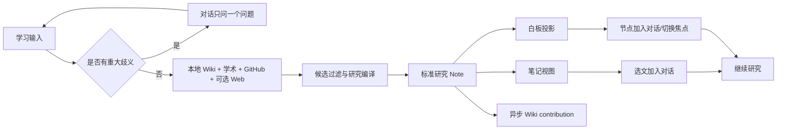

# Research Note Whiteboard Design

日期：2026-08-13
状态：Approved for implementation
Requirement：`docs/requirements/2026-08-13-notemeld-research-note-whiteboard.md`

> 演进说明（2026-08-14）：本文的研究编译管线继续作为前置基线；“Note 本体 + Sigma 只读投影”的白板实现已由 [`2026-08-14-notemeld-semantic-infinite-whiteboard-design.md`](2026-08-14-notemeld-semantic-infinite-whiteboard-design.md) 取代。实施白板交互、数据模型、上下文引用或 Note 发布时必须以后者为准。

## 设计结论

采用“Note 是本体，Whiteboard 是投影”的单事实源架构。一次学习研究最多产生一篇标准 Note；白板只保存由 Note 和已确认证据编译出的节点、关系、焦点和展示缓存。中间对话负责修正目标、提出问题和确认写入，右侧负责线性阅读与关系导航。

## 用户流程



## 领域边界

### ResearchNoteCompiler

- 输入：goal、本地 Wiki 片段、已过滤外部 sources、provider/model。
- 输出：`clarifying` 或 `ready`。
- clarifying：一个 question、2-4 个互斥 options、`可自行补充` 提示；不创建 Note。
- ready：title、overview、Markdown sections、typed nodes/edges、suggested actions。
- 节点类型限定 `topic | concept | claim | evidence | conflict | case | question`；source 标题不能自动成为节点。
- 模型输出必须通过 Pydantic；非法、超时或无模型时使用 deterministic fallback。

### Candidate relevance

- 先规范化 goal/title/snippet，抽取中文连续词和英文/数字 token。
- 明显无词项重叠且不来自本地已命中内容的外部候选被丢弃。
- 每类来源有上限并按相关词覆盖、metadata 可信度排序。
- 过滤是安全门而非最终排序；最终概念由 compiler 产生。

### Research Note

固定顶层结构：研究范围、概览、基础定义、核心结构、判断框架、冲突与证据、代表案例、开放问题、来源。允许 compiler 省略没有证据的细分内容，但不得伪造来源。通过 `NoteImportService` 写 `note_results/{task_id}.json`、`note_documents`、向量索引和 Wiki extraction queue。

### Whiteboard projection

- LearningCanvas version 2 绑定 `document_task_id`。
- node 摘要和 label 是可重建展示缓存；正文权威仍为 Note Markdown。
- edge 表达 `contains | supports | challenges | depends_on | example_of | related`。
- 右侧白板首屏只显示图和一个选中节点；缩放、平移、适配、点击选中、右键引用。
- version 1 继续由旧数据直接投影；没有 document_task_id 时隐藏笔记切换。

## 对话引用契约

```json
{
  "id": "ref_uuid",
  "type": "note_selection",
  "document_task_id": "note_xxx",
  "canvas_id": "lc_xxx",
  "node_id": null,
  "label": "核心结构",
  "snapshot": "有界文本快照",
  "source_ids": []
}
```

- type 为 `note_selection | whiteboard_node`。
- 单条 snapshot 最多 2000 字符，最多 8 条；前端与后端同时裁剪。
- 引用写入 user message meta，使历史可复现；free-chat request 同时传 context_refs。
- 后端把引用格式化为隔离的“用户选定研究上下文”，不能把引用内容当系统指令。

## 下一步建议

- `focus`：payload 只含 canvas_id/node_id，点击后 dispatch focus，不请求 LLM。
- `research`：payload 含 prompt，点击后填入 composer；由用户发送才请求 LLM/研究。
- 每条 ready 摘要最多 4 个建议；建议随消息持久化。

## 成功边界和失败处理

1. NoteImportService 返回成功即研究正文成功。
2. canvas 保存或 compact message 失败不得删除已创建 Note；下次可从 Note 重建投影。
3. Wiki extraction 是异步后处理，状态独立。
4. clarifying 不写 Note，避免错误实体污染知识库。
5. 外部 provider 部分失败保留本地和成功来源；全部失败使用明确“证据不足”框架。

## UI 结构

- 桌面：左侧会话列表 / 中间对话 / 右侧研究内容。
- 右侧 header：研究 Note 下拉（复用现有 document selector）+ `笔记 | 白板`。
- 笔记：复用 MarkdownViewer；选文右键出现“添加到对话”。
- 白板：精简 LearningCanvasCard；不显示学习路径、掌握度、复习队列和来源墙。
- 中间：clarification 或 research summary；summary 下显示预测动作。
- Composer：引用 chips 位于输入框上方，支持删除；发送后清空当前引用。
- 移动端：对话/笔记/白板为内容 tab，不并排。

## 兼容策略

- conversation mode 仍为 chat/note；learn 仍是前端 intent。
- 原 API path 与旧字段保留；新增字段均可选。
- mastery/session/evidence 不删除，旧 UI 能力仅不再作为默认研究入口展示。
- 不新增依赖、数据库迁移或 native API。

## 测试边界

- 单元：相关性过滤、编译 schema/fallback、clarification、Note markdown、context ref 裁剪。
- 服务：ready 创建 Note 并绑定；clarifying 不写；外部 sources 不转节点；message compact。
- API：可选模型字段、context_refs、404/400/503 和 wrapper。
- 前端：双视图、右键引用、chips/payload、动作类型、legacy fallback。
- 回归：chat/note/Wiki/desktop ready、旧 canvas 读取。

## 自审

- 无 TODO/TBD 或未定义接口。
- Note 权威与 canvas 缓存无矛盾。
- 写入成功边界、旧数据、失败降级和引用上限均明确。
- 单一纵向闭环可独立交付；自由绘图等演进项已排除。

## 2026-08-14 增量规格：整块白板

### 组件边界

- `Home.tsx`：白板分支直接挂载 `LearningCanvasCard` 并提供剩余高度，不再增加右侧内容滚动层。
- `LearningCanvasCard.tsx`：只负责工具栏、图画布、单个选中节点浮层和零关系提示；删除固定详情 footer。
- `LearningCanvasGraph.tsx`：提供相对定位画布容器，让浮层属于白板而非页面附属区域。
- `SigmaWikiGraph.tsx`：`focusNode` 从 renderer 读取 display data；`resetView` 使用 Camera reset；ResizeObserver 在尺寸变化后调用 resize/refresh，并恢复适配视图。
- `layout.ts`：无边图不运行 ForceAtlas2，改用确定性紧凑环形布局，避免孤立节点被斥力推散。

### 交互状态

- 打开白板默认选中第一个节点，因此最多出现一张节点摘要卡。
- 点击另一个节点替换摘要卡；点击 Stage 将 `selectedNodeId` 清空并关闭卡片。
- 摘要卡展示节点类型、标题、最多三行摘要和“添加到对话”；不渲染所有节点正文。
- `edges.length === 0` 时在画布顶部显示弱提示，不阻塞缩放、选中与引用。

### 兼容与风险

- 不修改 Canvas JSON、API 或引用 payload，历史画布直接受益。
- ResizeObserver 回调必须在 unmount 时断开，并把 animation frame 一并取消，避免隐藏视图残留刷新。
- 若 Sigma 尚未返回 display data，聚焦动作安全 no-op；初始 reset 仍保证图可见。

### 验证

- `node frontend/tests/learningCanvasContracts.test.mjs`
- `cd frontend && pnpm test:contracts`
- `cd frontend && pnpm build`
- 本地手工：打开 8 节点/0 边 Canvas，切换笔记→白板、适配、聚焦、点击空白、添加节点到对话。
