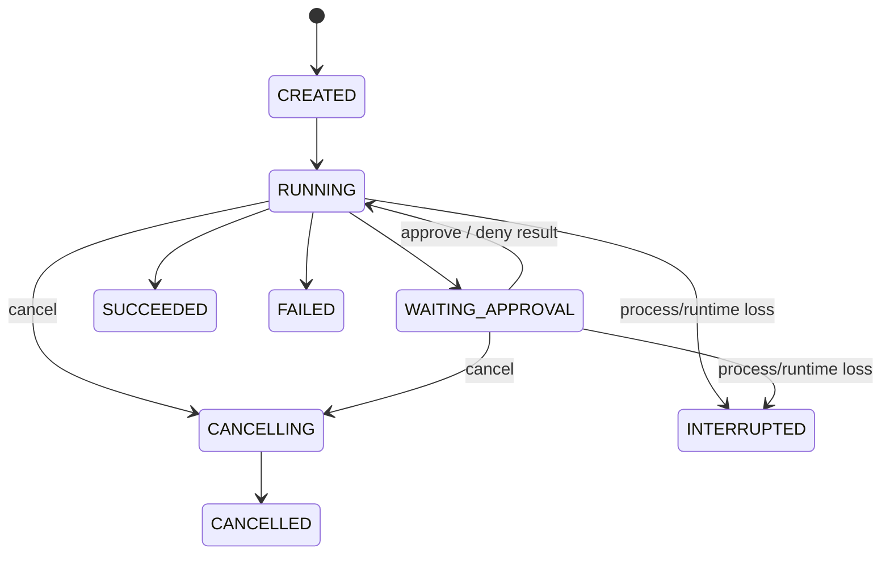

# 跨平台 NoteMeld Agent SDK 与统一 UI/CLI 设计规格

日期：2026-08-14  
作者 / Agent：Codex（doc-driven + brainstorming）  
状态：Awaiting User Review  
Canonical Requirement：`docs/requirements/2026-08-14-universal-agent-sdk-unified-cli.md`  
Change Spec：`docs/system/change-spec-universal-agent-sdk-unified-cli.md`

## 1. 设计结论

本设计采用以下已确认决策：

1. Rust 是 NoteMeld Agent 唯一跨平台核心实现；Python Agent Core 作为迁移 oracle 和一发布周期 rollback，不再继续演化为第二套正式实现。
2. 对外提供一个版本化 `notemeld-agent-sdk` 产品；内部允许使用职责单一的 Cargo crates。
3. macOS、Windows、Linux server、iOS、Android 和 OpenHarmony 产物来自同一 Rust workspace 与 conformance suite。
4. 当前 FastAPI 后端通过 Python binding 进程内加载 SDK，成为 NoteMeld Agent Host。
5. UI 与 `notemeld agent` CLI 只负责输入和事件渲染；Session/Turn/历史/持久化/审批属于 Host。
6. AgentSession id 与现有 Conversation id 相同；不建立第二套会话事实源。
7. 同一 Session 同时只能有一个活动 Turn；不同 Session 可并行。
8. AgentEvent 是 Rust、FFI、HTTP SSE 和 CLI JSONL 的共同协议。
9. 本次交付移动端/OpenHarmony SDK 和最小 harness，不交付完整移动应用。
10. 远程设备互调与 Harbor 接入后置。

## 2. 总体架构

```mermaid
flowchart TB
    subgraph Consumers[平台入口]
        UI[React / Tauri UI]
        CLI[notemeld agent CLI]
        IOS[iOS Swift harness]
        AND[Android Kotlin harness]
        OH[OpenHarmony ArkTS harness]
        SERVER[Web Backend Host]
    end

    subgraph SDK[notemeld-agent-sdk - 单一 Rust 源码]
        CORE[agent-core]
        EVENTS[agent-events]
        MODEL[agent-model]
        TOOLS[agent-tools]
        CAPS[agent-capabilities]
        SESSION[agent-session]
        STORE[agent-storage]
        FFI[agent-ffi]
        CLIBIN[agent-cli]
    end

    subgraph Host[NoteMeld Agent Host]
        API[Agent v1 API]
        PY[Python Binding / Drivers]
        TURN[Turn Manager / Event Broker]
        APPROVAL[Approval Policy]
        DB[(SQLite + Note Files)]
        PRODUCT[Wiki / Note / Memory / Workspace / Skill / MCP]
    end

    UI --> API
    CLI --> API
    SERVER --> PY
    IOS --> FFI
    AND --> FFI
    OH --> FFI
    API --> TURN
    TURN --> PY
    PY --> FFI
    FFI --> CORE
    CORE --> EVENTS
    CORE --> MODEL
    CORE --> TOOLS
    CORE --> CAPS
    CORE --> SESSION
    SESSION --> STORE
    PY --> PRODUCT
    TURN --> DB
    CLIBIN --> API
```



## 3. SDK 物理结构

建议仓库结构：

```text
agent-sdk/
├── Cargo.toml
├── rust-toolchain.toml
├── crates/
│   ├── agent-core/
│   ├── agent-events/
│   ├── agent-model/
│   ├── agent-tools/
│   ├── agent-capabilities/
│   ├── agent-session/
│   ├── agent-storage/
│   ├── agent-ffi/
│   └── agent-cli/
├── bindings/
│   ├── python/
│   ├── swift/
│   ├── kotlin/
│   └── harmony/
├── schemas/
│   ├── turn-request.v1.json
│   ├── agent-event.v1.json
│   └── errors.v1.json
├── fixtures/
│   └── conformance/
└── examples/
    ├── python-host/
    ├── ios-harness/
    ├── android-harness/
    └── harmony-harness/
```

对外仍称一个 SDK；拆 crate 是为了隔离依赖和平台能力，不允许各 crate 各自定义 Turn/Event 语义。

## 4. Crate 职责与依赖方向

### `agent-events`

- 定义 schema version、SessionId、TurnId、EventId、sequence、timestamp。
- 定义 AgentEvent/AgentError/TurnStatus 的唯一枚举。
- 不依赖模型、工具、存储或平台 API。

### `agent-model`

- 定义 `ModelDriver`、model descriptor、stream chunks、usage、finish reason、tool call delta。
- 提供通用 OpenAI-compatible driver 的可选 feature；本地模型和平台专属 provider 通过 Driver 注入。
- 不读取 NoteMeld SQLite 或环境变量。

### `agent-tools`

- 定义 Tool descriptor/schema、ToolDriver、ToolResult、progress、risk classification。
- 实现并行/串行调度、顺序稳定、abort 传播和审批 hook。
- 不包含 NoteMeld note/wiki 的具体实现。

### `agent-capabilities`

- 维护 L0–L3 渐进式发现、describe、invoke 和 capability manifest。
- 通用路由逻辑进入共享 crate；具体 Wiki/Skill/MCP provider 由 Host 注册。

### `agent-session`

- 定义 SessionCoordinator、AgentTurn、幂等 request、单活动 Turn、状态机和控制命令。
- 调用 Store trait 保存 Session/Turn/Event，不知道 SQLite 表名。

### `agent-storage`

- 定义 SessionStore/TurnStore/EventStore/PreferenceStore traits。
- 提供通用 SQLite reference implementation 供移动/独立 Host 使用。
- NoteMeld 当前后端使用 adapter 映射既有 Conversation/Message schema。

### `agent-core`

- 组合 model/tools/capabilities/session/events，执行唯一 Agent loop。
- 提供 prompt/continue/cancel/steer/follow-up。
- 不直接构造任何 Provider、数据库、FastAPI、UI 或文件路径。

### `agent-ffi`

- 暴露稳定 C ABI 与语言 binding。
- Rust 内部使用强类型；FFI 边界使用版本化 DTO/JSON envelope，避免在不同语言复制事件语义。
- FFI panic 必须被捕获并映射为 `sdk_internal_error`，不能越过 ABI。

### `agent-cli`

- 只实现终端交互、Agent v1 HTTP/SSE client、JSONL 输出和 Host discovery。
- 不直接打开 NoteMeld SQLite，不内嵌另一套 Agent loop。

依赖方向只能从组合层指向抽象层；core/events/tools 不得反向依赖 NoteMeld Host。

## 5. SDK 公共接口

概念 Rust API：

```rust
pub struct AgentRuntime<D: Drivers> { /* private */ }

impl<D: Drivers> AgentRuntime<D> {
    pub async fn create_session(&self, request: CreateSessionRequest) -> Result<Session, AgentError>;
    pub async fn open_session(&self, session_id: SessionId) -> Result<Session, AgentError>;
}

impl Session {
    pub async fn start_turn(&self, request: StartTurnRequest) -> Result<TurnHandle, AgentError>;
}

impl TurnHandle {
    pub fn id(&self) -> &TurnId;
    pub fn subscribe(&self, after_sequence: Option<u64>) -> AgentEventStream;
    pub async fn cancel(&self, reason: CancelReason) -> Result<(), AgentError>;
    pub async fn steer(&self, input: UserInput) -> Result<(), AgentError>;
    pub async fn resolve_approval(&self, decision: ApprovalDecision) -> Result<(), AgentError>;
    pub async fn result(&self) -> Result<TurnResult, AgentError>;
}
```

约束：

- `StartTurnRequest.request_id` 必填并全局幂等。
- history 不属于 StartTurnRequest；SessionStore 提供权威历史。
- Driver 在 Runtime 构造时注入；Runtime 不读取 NoteMeld env/DB。
- FFI wrapper 的语义必须与 Rust API 一致。

## 6. Turn 状态机



规则：

- `SUCCEEDED/FAILED/CANCELLED/INTERRUPTED` 是终态，不能回到 RUNNING。
- cancel/steer/approval command 都幂等；重复 command 返回当前状态，不重复执行工具。
- 同 Session 存在 CREATED/RUNNING/WAITING_APPROVAL/CANCELLING 时，start_turn 返回 `session_busy`。
- 客户端传输断开不改变状态。
- Host 启动时扫描非终态并标记 INTERRUPTED；恢复运行是新 Turn，不复活旧 tool 副作用。

## 7. AgentEvent v1

统一信封：

```json
{
  "schema_version": "1",
  "event_id": "uuid",
  "sequence": 13,
  "session_id": "conversation-id",
  "turn_id": "turn-id",
  "timestamp": "2026-08-14T00:00:00Z",
  "type": "message.delta",
  "payload": {}
}
```

事件集：

- `turn.started`
- `message.started`
- `message.delta`
- `message.completed`
- `tool.started`
- `tool.progress`
- `tool.completed`
- `approval.required`
- `approval.resolved`
- `usage.updated`
- `turn.succeeded`
- `turn.failed`
- `turn.cancelled`
- `turn.interrupted`

协议规则：

- sequence 在单 Turn 内从 1 严格递增。
- event_id 全局唯一；`(turn_id, sequence)` 唯一。
- payload 允许新增可选字段；删除/改义必须升级 schema major。
- tool payload 只含脱敏参数摘要、工具名、call id、状态和安全结果摘要。
- approval payload 含 action digest/risk/summary/deadline，不含秘密或无需展示的完整 payload。
- SSE、JSONL、FFI callback 使用完全相同的事件 JSON。

## 8. Driver 与共享能力边界

SDK 定义：

```text
ModelDriver
ToolDriver
CapabilityProvider
SessionStore / TurnStore / EventStore / PreferenceStore
FileSystemDriver
SecureStorageDriver
Clock / IdGenerator
```

共享 Rust 代码负责：

- Agent loop、Turn、事件、工具调度、审批、上下文策略、capability routing。
- 通用 OpenAI-compatible HTTP provider（作为可选 feature）。
- 通用 MCP client（完成跨平台安全验证后启用）。
- 通用 SQLite reference store。

平台/产品 adapter 负责：

- Keychain/Keystore/Harmony secure storage。
- 平台文件 picker/sandbox 路径。
- 本地模型 runtime。
- NoteMeld Wiki/Note/Memory/Workspace/Skill 现有业务逻辑。

任何 adapter 都不能重新实现 Agent loop 或自行产生不符合 v1 的终态。

## 9. 平台构建产物

| 平台 | 目标产物 | 最小验证 |
| --- | --- | --- |
| macOS ARM64/x64 | Rust lib、Python wheel、CLI binary | Python Host load + CLI fake turn |
| Windows x64 | DLL/static lib、Python wheel、CLI exe | Host load + CLI fake turn |
| Linux x64/ARM64 | native lib、Python wheel/service artifact | server harness |
| iOS device/simulator | XCFramework + Swift wrapper | Swift harness fake turn |
| Android ARM64 | `.so` + AAR/Kotlin wrapper | Instrumented/JVM+native harness |
| OpenHarmony ARM64 | `.so` + N-API/ArkTS wrapper/HAR | ArkTS harness fake turn |

目标平台必须执行同一 fixture：fake streaming model 返回文本+两个 tool calls，验证事件顺序、tool result 顺序、cancel 和终态。

## 10. NoteMeld Agent Host

后端新增 `backend/app/agent_host/`：

- `runtime.py`：加载 native binding、版本/ABI 检查、单例生命周期。
- `drivers/model.py`：桥接 `backend/app/ai`。
- `drivers/tools.py`：桥接 capability registry 和产品工具。
- `drivers/storage.py`：映射 Conversation/Message/Agent tables。
- `turn_manager.py`：transaction、Session lock、active Turn registry、startup cleanup。
- `event_broker.py`：有界队列、批量 checkpoint、订阅/replay。
- `approval.py`：统一风险策略和决策。
- `preferences.py`：共享默认模型解析。
- `compat.py`：旧 chat API adapter。

FastAPI lifespan：

1. init_db 和 schema ensure。
2. 加载 SDK binding 并校验 ABI/schema version。
3. 标记残留活动 Turn 为 INTERRUPTED。
4. 注册 Host runtime ready 状态。
5. shutdown 时停止接受新 Turn，给活动 Turn 温柔取消/受控退出预算；独立 Host 正常由显式 stop 管理。

SDK 加载失败不允许静默切换到 legacy；Agent v1 返回 503，非 Agent API 保持可诊断。

## 11. 数据模型

### `agent_turns`

记录一次 durable Turn、幂等键、实际模型、消息关联、状态、sequence 和安全错误。`request_id` 唯一；`conversation_id` 索引；状态只允许设计枚举。

### `agent_events`

记录可重放事件。delta 批量 transaction，tool/approval/terminal 立即写。`(turn_id, sequence)` 唯一，payload 写入前统一脱敏。

### `agent_preferences`

当前本地单用户只保存一条默认 provider/model；若未来引入用户账户，再另做 user scope 迁移，不预造账号系统。

### 现有表

- `conversations.id` 即 session_id。
- `conversation_messages` 仍是页面/CLI 展示消息事实源。
- Agent 创建 user/assistant/tool/card message；客户端不得为同一 Turn 再追加一份。
- 实际 provider/model/turn_id/tool summary 写 assistant message meta；sources 继续使用 sources_json。
- 历史消息不回填假 Turn。

## 12. Agent v1 HTTP/SSE API

```text
POST /api/agent/v1/sessions
GET  /api/agent/v1/sessions
GET  /api/agent/v1/sessions/{session_id}
POST /api/agent/v1/sessions/{session_id}/turns
GET  /api/agent/v1/turns/{turn_id}
GET  /api/agent/v1/turns/{turn_id}/events
POST /api/agent/v1/turns/{turn_id}/cancel
POST /api/agent/v1/turns/{turn_id}/steer
POST /api/agent/v1/turns/{turn_id}/approvals/{approval_id}
GET  /api/agent/v1/preferences/model
PUT  /api/agent/v1/preferences/model
```

JSON endpoints 使用 NoteMeld ResponseWrapper。events endpoint 输出：

```text
id: 13
event: agent
data: {AgentEvent v1 JSON}
```

支持 `after_sequence` 和 `Last-Event-ID`。客户端断开不 cancel。Turn 完成后仍可读取持久事件。

模型解析顺序：request override → agent_preferences → models 表第一个可用行 → `model_not_configured`。

## 13. UI 设计

- `frontend/src/services/agent.ts` 成为新协议客户端，负责 start、SSE、reconnect、cancel、steer、approval、preference。
- ChatComposer 只创建前端 optimistic 输入投影；后端响应 ids 后以服务器消息为准。不得调用 Conversation API补写同一 user/assistant 消息。
- Zustand 保留 UI projection 和跨路由 loading，不作为 durable Turn 状态源。
- `message.delta` 更新投影；message/tool/approval/terminal 事件按 idempotent reducer 处理。
- 页面 reload 先取 Conversation/Turn 状态；活动 Turn 续订 after_sequence。
- `session_busy` 显示“该会话正在其他入口运行”，不自动重试提交。
- 模型未配置指向 Settings；共享默认模型由后端 preference API 维护。
- 危险审批使用同一 event/decision API，显示工具、风险与安全摘要。
- 保留桌面 BackendInit ready gate；SSE fetch 显式带 runtime session token。

## 14. CLI 设计

### 命令

```bash
notemeld agent
notemeld agent --conversation <id-or-title>
notemeld agent -p "question"
notemeld agent -p "question" --output text|json|jsonl
notemeld agent -p "question" --file <path> --yes
```

REPL 内建命令：

- `/new [title]`
- `/resume <id-or-title>`
- `/sessions`
- `/model`
- `/model <provider>/<model>`
- `/cancel`
- `/status`
- `/help`
- `/exit`

行为：

- 默认新建会话。
- `--conversation` 或 `/resume` 续聊。
- `/model` 更新共享默认模型，Turn override 不永久绑定 Session。
- text 给人阅读；json 只输出最终 result；jsonl 输出 AgentEvent。
- stdout 只输出协议/答案，stderr 输出诊断；exit code 区分输入、连接、模型、Turn、审批失败。
- 交互式审批提示 y/N；one-shot 默认 deny，只有 `--yes` 才允许策略允许的危险动作。
- `--file` 先通过现有 upload/ingestion 获得 attachment ref，不把任意本地路径直接暴露给 Host tool。

## 15. Host 生命周期、发现与 CLI 安装

### 运行时 descriptor

源码/安装环境各自维护运行目录中的 descriptor：

```json
{
  "schema_version": "1",
  "runtime_mode": "desktop|source-cli|source-script",
  "pid": 123,
  "api_base_url": "http://127.0.0.1:8483/api",
  "session_token": "secret",
  "data_dir": "...",
  "sdk_version": "..."
}
```

- Unix 权限 0600；Windows 使用当前用户 ACL。
- descriptor 不进入日志、API 响应或 crash report。
- CLI 验证 pid、health、token 和 data scope，不能只因端口占用就信任未知进程。

### 生命周期

- UI/CLI 都执行 ensure-running；single-instance lock 防止重复 Host。
- 安装版 CLI 启动安装版 Host/数据，源码 CLI 启动源码 Host/数据；两者不自动混用。
- UI 窗口关闭不 kill 活动 Host。Host 由 `notemeld stop`、系统退出或未来明确 idle policy 停止。
- 当前 Tauri `kill_backend()` 行为需迁移；切换前必须完成僵尸/端口/退出测试。

### CLI 安装

- 桌面首次启动检测 `notemeld`。
- 提供明确的一键用户级安装；失败显示路径/PATH修复步骤。
- 不静默编辑 `.zshrc/.bashrc/profile`。
- Windows 安装 user PATH entry 时必须可逆并由用户动作触发。

## 16. 安全与审批

- Agent v1 session/turn/preferences mutation 和 event stream 在本地模式也校验 runtime session token。
- 只监听 localhost；未来远程访问另开设计，不复用桌面 session token。
- tool risk：read、recoverable_write、destructive、external_write。
- read 默认允许；recoverable_write 执行并审计；destructive/external_write 需要审批。
- `--yes` 只表示客户端预批准，Host policy 仍可拒绝禁止动作。
- secrets 只保存在现有安全配置/本地文件，SDK event 和 Turn Store只保存脱敏摘要。

## 17. 兼容与切换

- `/api/chat/free*` 在一个发布周期内通过 compat adapter 调用新 Host，返回旧 delta/done/answer/sources。
- 新 UI/CLI 不使用 compat adapter。
- `AGENT_CHAT_ENABLED` 不控制新 UI/CLI；迁移期开启明确的内部 rollout/rollback 配置，但请求失败不得自动双跑。
- Python oracle tests 在 Rust conformance 完成前保留；切换完成后 legacy 删除需独立 Change Spec。
- 旧 Conversation/Message 不迁移为假 Turn。

## 18. 错误处理

稳定错误码至少包含：

- `agent_runtime_unavailable`
- `agent_schema_mismatch`
- `session_not_found`
- `session_busy`
- `turn_not_found`
- `turn_terminal`
- `duplicate_request`
- `model_not_configured`
- `model_unavailable`
- `context_budget_exceeded`
- `approval_required`
- `approval_expired`
- `tool_failed`
- `cancelled`
- `interrupted`
- `invalid_session_token`
- `sdk_internal_error`

错误 message 面向用户且脱敏；原始异常只允许进入受控 debug log，不能通过 SSE/JSONL 返回。

## 19. 验证设计

### 行为 oracle 与 conformance

- 从现有 Python tests 抽取固定 model/tool streams，不以真实 Provider 作为核心正确性判据。
- Rust native、Python binding、Swift/Kotlin/ArkTS harness 对同 fixture 生成相同事件 snapshot。
- 对 schema/sequence/status/tool order/cancel/approval/error code逐字段比较。

### NoteMeld 纵向

1. UI 新建会话并提问。
2. CLI resume 同一 id 并提问。
3. UI 刷新看到 CLI message/tool/source/model。
4. UI 活动 Turn 时 CLI提交得到 session_busy。
5. 断开 UI SSE，CLI/后端继续，重连恢复 sequence。
6. 关闭 UI，CLI活动 Turn完成。
7. 杀死 Host，重启后活动 Turn为 INTERRUPTED。

### 构建与发布

- Cargo fmt/clippy/test。
- Python wheels 在目标平台 import/load。
- iOS/Android/OpenHarmony harness build/run 或平台允许的最小加载测试。
- PyInstaller、Tauri、CLI installer、DMG/MSI contract。
- 现有 backend/frontend/core regression 全绿。

## 20. 实施分解约束

本设计规模超过单一实现任务，后续 `writing-plans` 必须生成依赖明确的阶段计划，至少分为：

1. SDK schema/oracle/foundation。
2. Rust core/session/tools/capability conformance。
3. FFI 与平台 artifact/harness。
4. Python binding、Agent Host、DB、API。
5. UI migration。
6. CLI、runtime lifecycle、installer。
7. Compatibility、packaging、release、system docs 和验收。

每一阶段必须先通过自己的测试和 review checkpoint，禁止阶段 1 未稳定就删除 Python legacy，或 Host API 未稳定就同时改 UI/CLI。

## 21. 设计非目标

- 不设计远程 Agent Node 协议或设备配对。
- 不设计跨设备数据同步。
- 不设计 Harbor adapter。
- 不设计完整移动端 NoteMeld UI。
- 不承诺所有现有 Python product tools 本次完成 Rust 重写。

这些范围需要独立 requirement/change spec，不能在实现阶段顺手加入。
