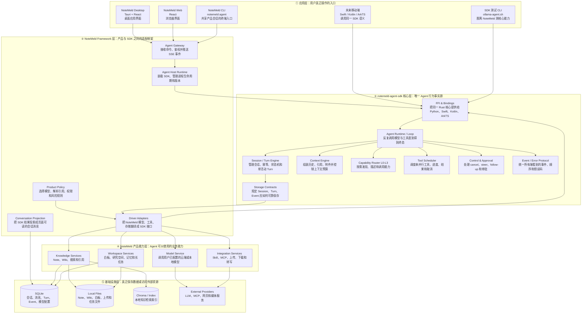
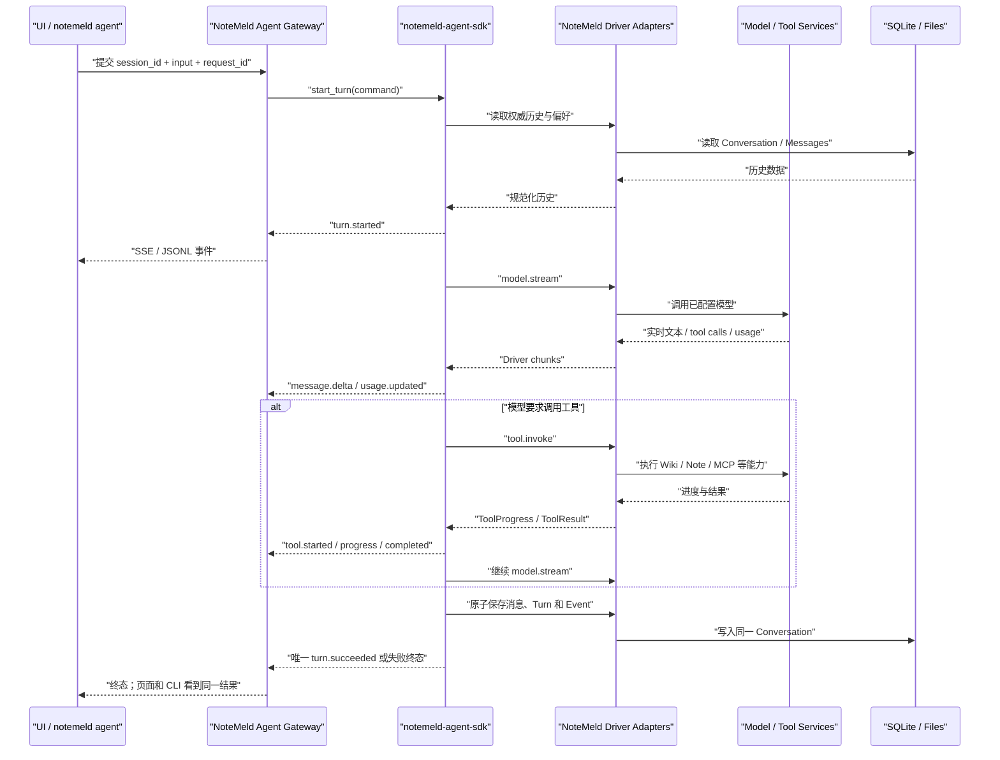

# Agent SDK 单一运行时目标架构

日期：2026-08-17
状态：Draft for Review（Plan 与 Execution Spec 已完成，等待用户确认）
Canonical Requirement：`docs/requirements/2026-08-17-agent-sdk-single-runtime-cutover.md`

## 1. 一句话结论

NoteMeld 的桌面、网页和 CLI 只负责“让用户发起操作和看结果”；NoteMeld Framework 负责“把产品数据与能力接到 SDK”；`notemeld-agent-sdk` 负责“Agent 如何思考、调用工具、控制 Turn 并产生标准事件”，且只有这一套 Agent 核心。

## 2. 分层架构

## 3. 每层到底负责什么

| 层 | 模块 | 白话说明 | 明确不负责 |
| --- | --- | --- | --- |
| 应用层 | Desktop / Web | 用户输入问题、查看回答、工具进度和审批提示的界面。 | 不运行 Agent loop，不直接写 Turn/Event。 |
| 应用层 | `notemeld agent` | 连接 NoteMeld Host 的产品 CLI，因此能和页面共享会话与数据库。 | 不直接打开 SQLite，不复制 Agent 核心。 |
| 应用层 | SDK Ollama CLI | 只用于脱离 NoteMeld 验证 SDK 本身和本地模型。 | 不读取 NoteMeld 笔记、会话或工具。 |
| Framework | Agent Gateway | 对外提供 Session/Turn/events/cancel/steer/approval API，并完成鉴权和错误映射。 | 不自行决定 Turn 状态，不伪造 SDK 终态。 |
| Framework | Agent Host Runtime | 在 FastAPI 进程中装载正确版本的 native SDK，并负责启动、停止和健康状态。 | 不实现 Agent loop，不自动回退旧 Python Agent。 |
| Framework | Product Policy | 把用户模型偏好、context refs 权限、危险操作规则变成 SDK 可消费的输入。 | 不直接执行模型或工具循环。 |
| Framework | Driver Adapters | 把 NoteMeld 已有 Python 业务接口翻译成 SDK 的 Model/Tool/Storage Driver。 | 不复制调度、取消、审批或事件语义。 |
| Framework | Conversation Projection | 把 SDK 的权威事件归并成会话列表需要的 user/assistant/tool 消息。 | 不把前端临时状态当成持久事实。 |
| SDK | Agent Runtime / Loop | 决定何时问模型、何时调用工具、何时继续下一轮以及何时结束。 | 不知道 NoteMeld 页面、数据库表名或 API。 |
| SDK | Session / Turn Engine | 保证同会话单活动 Turn、request_id 幂等和合法状态流转。 | 不让 Python Host 再维护另一份状态机。 |
| SDK | Context Engine | 从 Storage Driver 取得已由产品 Adapter 过滤的通用历史，校验结构、保持工具对完整并做预算裁剪。 | 不判断 NoteMeld 专有消息类型，不改写持久历史正文。 |
| SDK | Capability Router | 只向模型逐级暴露必要能力，避免一开始塞入所有 Wiki/Skill/MCP schema。 | 不包含 NoteMeld 具体 Wiki 或 MCP 配置。 |
| SDK | Tool Scheduler | 按规则执行一个或多个工具，保持结果顺序并传播进度、错误和取消。 | 不实现具体的搜索、写笔记或下载逻辑。 |
| SDK | Control & Approval | 让 cancel、steer、follow-up、审批都作用于正在运行的同一个 native Turn。 | 不允许 Host 只改数据库假装已经取消。 |
| SDK | Event / Error Protocol | 定义跨 Rust、FFI、HTTP SSE、CLI JSONL 的唯一事件格式和安全错误码。 | 不暴露 Provider 原始错误、Key 或工具秘密。 |
| SDK | Storage Contracts | 规定 Turn/Event 的原子写入、回放、幂等和恢复要求。 | 不绑定 NoteMeld 的 SQLAlchemy 模型。 |
| SDK | FFI & Bindings | 把 Rust 的同一行为提供给 Python、Swift、Kotlin 和 ArkTS。 | 不在各语言重新实现 Agent。 |
| 产品能力 | Model Service | 根据 NoteMeld 中用户保存的 Provider/模型配置发起真实 LLM 请求。 | 不管理 Session/Turn。 |
| 产品能力 | Knowledge/Workspace/Integration | 提供 Note、Wiki、白板、记忆、Skill、MCP、下载等可调用能力。 | 不决定模型下一步要调用什么。 |
| 基础设施 | SQLite/Files/Providers | 保存本地数据并访问外部模型或内容服务。 | 不包含 Agent 决策逻辑。 |

## 4. 一次真实对话如何流动

## 5. SDK 对外应该提供的核心能力

### 5.1 会话与 Turn

- `create/open session`：创建或打开一个可持续多轮提问的会话。
- `start turn`：在同一会话中开始一次请求，并用 request_id 保证重试不重复执行。
- `subscribe/replay`：从指定 sequence 回放并继续接收实时事件。
- `cancel/steer/follow-up`：控制当前 Turn 或为下一 Turn 排队输入。
- `resolve approval`：对危险动作批准、拒绝或超时处理。

### 5.2 模型与上下文

- 统一 ModelDriver 契约，支持真正的增量 chunk、tool call、usage、finish reason 和取消。
- 从 Store 读取历史，由 SDK 统一过滤、归一化和控制 token 预算。
- 保持 system、最新 user、assistant tool call 与 tool result 的成组语义。
- 支持附件和可信 context refs，但具体引用解析由 NoteMeld Framework 完成。

### 5.3 工具与能力

- 工具 schema、风险级别、进度、结果和稳定错误码。
- 串行/并行调度与稳定结果顺序。
- L0 能力地图、L1 候选发现、L2 schema 描述、L3 实际调用。
- 工具执行前审批 hook，执行中取消，执行后安全摘要。

### 5.4 协议、存储与跨平台

- 唯一 AgentEvent v1 和 AgentError v1。
- Turn/Event 原子写入、幂等、sequence、终态和 interrupted 恢复契约。
- Rust 原生 API、稳定 C ABI、Python/Swift/Kotlin/ArkTS binding。
- SDK 自测试 CLI 和跨平台 artifact/smoke 校验。

## 6. 当前 SDK 已有、需要加强、需要新增

| 能力 | 当前情况 | 目标动作 |
| --- | --- | --- |
| Rust Agent loop | 已有 fixed loop、max turns、model→tool→model。 | 加强为 session-oriented runtime，并组合 session/storage/capability/control。 |
| AgentEvent / AgentError | 已有 v1 schema、sequence、终态和安全错误。 | 加强 required 字段、真实 SSE/JSONL 回放和持久化一致性。 |
| ModelDriver | 已有请求/完成和可选 chunks。 | 新增真正异步流式 chunk ABI；NoteMeld 不再等待完整响应后假装流式。 |
| ToolDriver | 已有调度、并发、取消和进度契约。 | 接入 FFI progress、describe 和 NoteMeld capability adapter。 |
| CapabilityRegistry | 已有 L0-L3 基础实现。 | 组合进 core runtime，统一 tool discovery/describe/invoke。 |
| Session/Turn | 已有状态机、lease 和幂等基础。 | 组合进正式 Runtime；删除 Host 的第二套活动 Turn 状态机。 |
| Storage | 已有 traits 和 reference SQLite。 | 新增生产 Storage Driver/FFI 接口；NoteMeld adapter 映射现有 Conversation。 |
| 历史续聊 | Rust core 可接 history，但 FFI 总是传空历史。 | 新增 SDK 通过 Store 获取历史的正式路径，独立 CLI 和 NoteMeld 都复用。 |
| Cancel | SDK native cancel 已有。 | 让 NoteMeld API 调用真实 turn handle，再由 SDK产生 cancelled 终态。 |
| Steer | FFI 明确返回 unsupported。 | 新增运行中输入通道、顺序和幂等语义。 |
| Approval | 有状态/事件 DTO，没有完整执行链。 | 新增 policy hook、waiting state、resolve/timeout/deny 和工具恢复。 |
| Follow-up / Resume | 尚无正式跨 FFI API。 | 新增 session queue/下一 Turn 语义和中断恢复边界。 |
| Python binding | 已能加载 native、提交、等待和回调。 | 保留为薄 binding；补异步事件、stream driver、history/store/control API。 |
| 跨平台 binding | Swift/Kotlin/Harmony 已有薄层和 CI 契约。 | 在新 ABI 上同步，不允许各端复制业务语义。 |
| SDK 独立测试 | Ollama shell 已可单轮/表面多轮测试。 | 加强为真正有历史、多轮、工具、取消和模型切换的能力测试。 |

## 7. NoteMeld Framework 需要新增或加强

| 模块 | 当前问题 | 目标动作 |
| --- | --- | --- |
| `AgentSdkHost` | 目前每个 executor 临时创建 Runtime，并以线程等待 30 秒。 | 改为进程级 Runtime，异步提交 Turn，维护 SDK handle 映射和优雅关闭。 |
| Storage Adapter | `ConversationHistoryStore` 存在但未进入 native turn。 | 实现 SDK Store contract，把历史、Turn、Event、消息投影放入同一事务边界。 |
| Model Adapter | 当前没有正确消费 FFI `payload`，也没有向 native 推实时 chunks。 | 规范化 driver request，真实转发 streaming、usage、tool call 和 cancel。 |
| Tool Adapter | 类已存在但 executor 对 `tool.invoke` 统一返回“尚未接入”。 | 接入请求级 CapabilityRegistry 和现有 Note/Wiki/Skill/MCP provider。 |
| Event Stream | 当前 events endpoint 只回放一次即结束；EventBroker 未接入。 | 先持久回放，再持续订阅 live broker，终态后关闭，支持 Last-Event-ID。 |
| Cancel/Steer/Approval | cancel 只改 DB；steer/approval 是占位。 | 全部路由到 SDK control plane，由 SDK产生状态与事件。 |
| Conversation Projection | 当前只可靠保存用户消息，助手/工具结果不完整。 | 根据 SDK message/tool/terminal 事件幂等 upsert 权威会话消息。 |
| Model Preference | 当前偏好按 session，且只有模型名。 | 按产品要求增加全局默认 provider/model + 有序 fallback，并允许 Turn override。 |
| Security | Agent fetch 未统一复用桌面 session header。 | Gateway mutation/stream 统一鉴权，事件和错误统一脱敏。 |
| Runtime packaging | 开发路径和 packaged import 同时存在。 | 开发可显式指定 artifact；正式启动只接受已构建、版本匹配的 SDK package。 |
| SDK source ownership | NoteMeld 仓库仍内嵌一份 `agent-sdk/` 源码和构建 workflow。 | 独立 SDK 仓库成为唯一源码/CI；NoteMeld 删除副本并只校验、安装 artifact。 |

## 8. 必须删除的旧 Agent 逻辑

删除必须发生在新链路纵向验收之后，但最终架构中不保留这些运行分支：

- `backend/app/agent/core/` 的 Python Agent loop、state、event、message、tool 和 signal 实现。
- `backend/app/agent/agent_service.py`、`sse_bridge.py` 对旧 core 的执行依赖。
- `AGENT_CHAT_ENABLED` 的 legacy/new 双路和 `NOTEMELD_AGENT_MODE=python-oracle` 自动/显式回滚模式。
- `backend/app/agent_host/compat.py` 及 `/api/chat/free*` 的 Agent 兼容执行路径。
- Host 自己维护的第二套 Turn 状态机、终态制造和仅改数据库的 cancel。
- 前端或 CLI 对同一 Agent Turn 直接写入 Conversation/AgentEvent 的职责。
- NoteMeld 仓库中的 `agent-sdk/` 源码副本及只为构建该副本存在的 workflow；SDK CI 移入独立仓库。

可以保留并改造成 Adapter 的产品能力：builtin tools、memory、workspace、skill loader、MCP client、long task、capability provider、Wiki/Note/whiteboard services。

## 9. 两种 CLI 必须区分

| CLI | 用途 | 是否启动 NoteMeld | 数据来源 |
| --- | --- | --- | --- |
| `notemeld-agent-sdk/scripts/ollama-agent.sh` | 评估独立 SDK 的 Agent 核心能力。 | 否 | SDK 自己的测试 session/store + Ollama。 |
| `notemeld agent` | 使用 NoteMeld 产品中的统一 Agent。 | 会连接或确保 NoteMeld Agent Host 可用。 | NoteMeld 的 Conversation、Note、Wiki、模型和工具。 |

这两个入口共用 SDK 的 Agent 行为，但 Host Driver 和数据域不同；前者证明 SDK 能独立工作，后者证明 NoteMeld 正确接入。

## 10. 架构硬规则

1. Agent 的状态变化只能由 SDK 产生，Host 只能持久化和发布。
2. Agent 的模型/工具调用只能通过 SDK Driver contract 发起，Host 不能绕过 SDK另跑一轮。
3. UI、CLI 不能直接写 Agent Turn/Event；optimistic UI 只是临时投影，必须用服务器 ID 对账。
4. 同一个 Turn 只允许一个 terminal event。
5. SDK 加载或 schema/version 校验失败必须 fail-closed，不能切换第二套实现。
6. 产品数据归 NoteMeld；Agent 行为归 SDK；平台差异归 binding/adapter。
7. 历史数据可读与旧运行逻辑兼容是两件事：前者必须保留，后者明确删除。

## 11. 建议实施顺序

1. SDK 强化：session-oriented runtime、history/store、真实 streaming、control/approval、capability integration。
2. SDK 独立验收：Ollama 真多轮、工具、取消、模型切换、事件回放。
3. NoteMeld Host 重构：进程级 Runtime 和唯一 Driver/Storage/Event 路径。
4. Agent API 完整化：live SSE、cancel、steer、approval、global model preference。
5. UI/CLI 正式切换：只走 Agent v1，服务器权威消息与断线恢复。
6. 删除旧逻辑：清除 Python core、compat、feature flag 和重复状态机。
7. 全量回归与打包：源码、桌面、CLI、MCP、Note/Wiki、迁移、发布 artifact。

## 12. 架构验收门槛

- 生产 import 搜索不再引用 `backend/app/agent/core`。
- SDK direct Ollama 至少连续三轮能记住会话历史。
- NoteMeld UI 创建会话、CLI 续聊、页面刷新后消息一致。
- 模型 delta、工具进度、审批、cancel、steer、成功/失败均经过同一 SDK event schema。
- SSE 断线后按 sequence 回放并继续 live stream。
- 相同 request_id 不重复消息、模型请求或工具副作用。
- SDK 缺失/版本错误不会执行旧 Agent。
- 历史 Conversation/Note/Wiki/Whiteboard 数据仍可读取。

## 13. Knowledge Services 的 K0-K3 增量架构

Knowledge Services 的详细增量由以下文档管理：

- Requirement：`docs/requirements/2026-08-18-k0-k3-article-knowledge-retrieval.md`
- Plan：`docs/superpowers/plans/2026-08-18-k0-k3-article-knowledge-retrieval.md`
- Execution Spec：`docs/superpowers/specs/2026-08-18-k0-k3-article-knowledge-retrieval-execution.md`

这里的 `K0-K3` 是知识数据层，不是 SDK Capability Router 的 `L0-L3`：

| 知识层 | 语义 | NoteMeld 存储/服务 |
| --- | --- | --- |
| K0 | 文档事实源与有界原文读取 | NoteDocument + NoteResult/Markdown |
| K1 | page/section/time-aware 原文证据块 | 共享版本化向量索引 |
| K2 | 每篇文章的高密文档画像 | 共享 profile 向量索引 |
| K3 | 实体、概念、关系和来源 provenance | occurrence BM25/vector + SQLite graph |

四层统一使用 `article_id`；其值直接复用现有 `task_id`，不新增第二套文章主键。NoteMeld 向 SDK 注册四个同级 capability：

- `knowledge:article_lookup`
- `knowledge:evidence_search`
- `knowledge:profile_search`
- `knowledge:semantic_search`

四个 capability 没有 K 层调用顺序和前置依赖。Agent 可以独立、串行或并行调用，也可以通过统一返回的 `article_id` 组合结果。SDK 继续只负责通用 discover/describe/invoke、调度、取消和事件；NoteMeld Host/Knowledge Services 负责 article filter、索引、图谱、来源和权限。不得把 K0-K3 数据逻辑写入 SDK，也不得在 Host 建立强制 K3→K2→K1 状态机。
