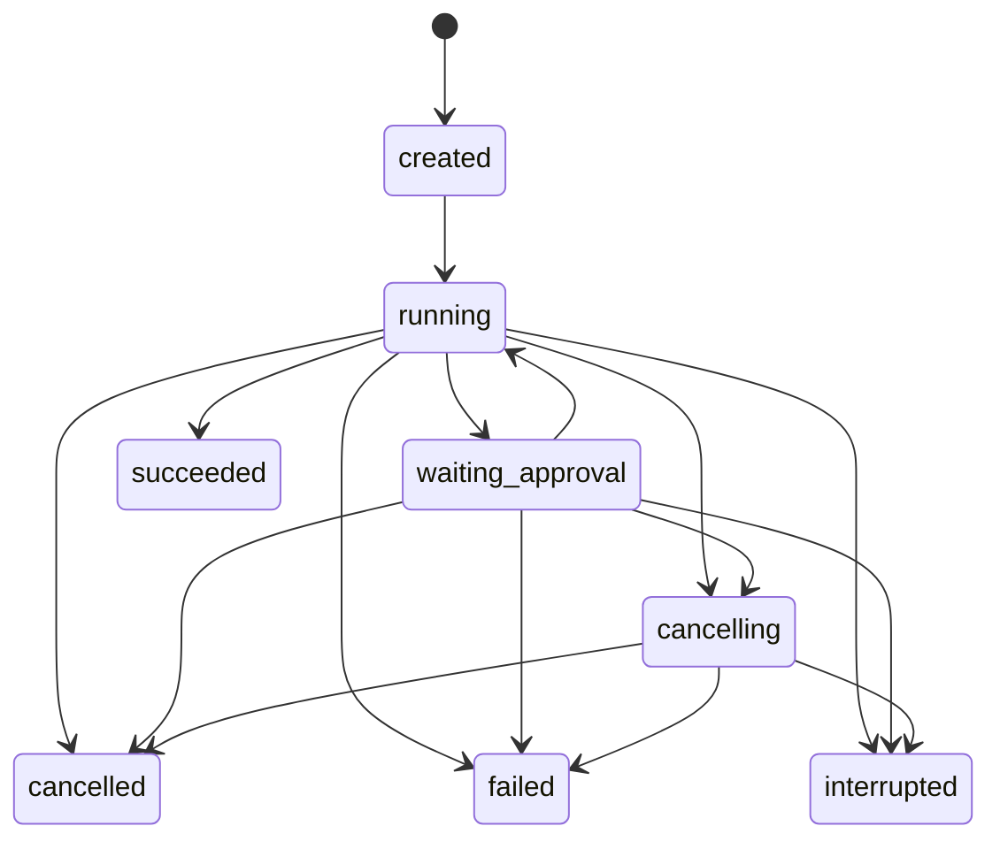

# Agent SDK 单一运行时与 NoteMeld 正式切换执行规格

日期：2026-08-17
状态：Draft for Review（用户确认后才可改为 Ready for Execution）
Canonical Requirement：`docs/requirements/2026-08-17-agent-sdk-single-runtime-cutover.md`
Change Spec：`docs/system/change-spec-agent-sdk-single-runtime-cutover.md`
目标架构：`docs/superpowers/specs/2026-08-17-agent-sdk-single-runtime-architecture.md`
实施计划：`docs/superpowers/plans/2026-08-17-agent-sdk-single-runtime-cutover.md`

## 1. 本规格的作用

本文件把目标架构变成可以逐 Task 实施和验收的精确契约。它规定 SDK 与 NoteMeld 的职责边界、Rust Runtime、Host Driver、FFI、HTTP/SSE、SQLite、前端、CLI、迁移、删除和测试语义。

在用户确认前：

- 不修改 Rust、Python、TypeScript、Tauri、数据库迁移或打包代码。
- 不删除旧 Agent 文件。
- 不把本文档中的接口草案声称为已实现。
- 允许继续审阅和修改 Requirement、Plan、Spec。

用户确认后，执行者必须按照 Plan 的 Task 1–19 顺序工作；每个 Task 都先取得有效 RED，再做最小 GREEN，不得绕过 Gate。

## 2. 决策摘要

| 决策 | 已冻结的结论 |
| --- | --- |
| Agent 核心归属 | `notemeld-agent-sdk` 是唯一 Agent loop、Turn 状态、事件、调度、控制和审批事实源。 |
| NoteMeld 归属 | NoteMeld 只保留产品 Host、模型/工具/存储 Adapter、API、鉴权、进程生命周期和 UI/CLI。 |
| 历史兼容 | 不兼容旧 Python Agent 执行逻辑；保留历史 Conversation、Message、Note、Wiki、白板、模型和用量数据。 |
| Provider/业务能力 | 继续由 NoteMeld 执行；SDK 不读取 NoteMeld 表名、文件路径或 Provider 凭证。 |
| SDK 独立运行 | SDK 自带 reference Store 和 Ollama Host，可以脱离 NoteMeld 真正多轮实测。 |
| 产品 CLI | `notemeld agent` 调用 NoteMeld Agent v1，与 UI 共享同一数据库和会话。 |
| SDK 测试 CLI | `ollama-agent.sh` 只测试 SDK，不启动 NoteMeld，也不读取 NoteMeld 数据。 |
| 回滚 | 通过 Git/发布版本整体回滚，不在运行时保留 legacy fallback。 |
| Harbor | 不在本次范围；单一运行时完成后另立 Requirement。 |

## 3. 仓库、版本和发布边界

### 3.1 两个独立仓库

| 仓库 | 路径 | 交付内容 |
| --- | --- | --- |
| Agent SDK | `/Users/hehejie/ai/notemeld-agent-sdk` | Rust workspace、C ABI、Python/Swift/Kotlin/ArkTS bindings、SDK CLI、artifact。 |
| NoteMeld | `/Users/hehejie/ai/NoteMeld` | FastAPI Agent Host、产品 Adapter、SQLite 映射、React、产品 CLI、桌面打包。 |

约束：

- 两个仓库使用各自分支、提交和测试证据，不创建跨仓库的单一提交。
- NoteMeld 的正式构建只消费带 checksum/version/ABI manifest 的 SDK artifact，不依赖相邻源码目录。
- 开发模式可以显式指定本地 artifact；不得通过隐式 `sys.path` 搜索任意目录。
- SDK Gate 3 完成并发布可验证 artifact 后，才开始 NoteMeld 生产 consumer 切换。
- 当前 NoteMeld 内嵌 `agent-sdk/` 只是迁移遗留；有价值的差异先合并进独立仓库，Gate 7 前删除整个目录及其本地 build workflow。

### 3.2 目标版本

| 项目 | 当前基线 | 本次目标 | 规则 |
| --- | --- | --- | --- |
| SDK package | `0.1.0` | `0.2.0` | Session Runtime、Driver/Control/Store 能力扩展属于 minor 版本。 |
| AgentEvent schema | `1` | `1` | 只允许新增 optional payload 字段；改字段含义或 required 集合才升级。 |
| AgentError schema | `1` | `1` | 稳定 code 不改义；新增 code 必须同步 schema/tests/bindings。 |
| Native ABI manifest | `1` | `2` | 新增流式 Driver、Store、Steer、Approval API；不承诺 ABI v1 运行兼容。 |
| NoteMeld Agent HTTP | `/api/agent/v1` | `/api/agent/v1` | 补完整语义，不新增第二套路由。 |

SDK artifact 必须同时声明 `sdk_version=0.2.0`、`abi_version=2`、`agent_schema_version=1`。任一不匹配时 Agent Host fail-closed；Note、Wiki 等非 Agent API 不受影响。

## 4. 分层所有权契约

### 4.1 SDK 必须拥有

- Session/Turn 状态机、单 Session 单活动 Turn、request_id 幂等判定。
- 模型→工具→模型循环、最大轮数、工具串并行调度和结果排序。
- 通用历史消息校验、tool call/result 配对、上下文预算和裁剪诊断。
- L0–L3 Capability 发现、描述、调用协议和工具 allowlist 的执行门禁。
- Cancel、Steer、Approval 的运行中控制语义。
- AgentEvent sequence、唯一 terminal、AgentError 安全语义。
- Store 调用时机和 durable-before-publish 顺序。
- Rust API、C ABI 以及各语言薄 binding 的一致语义。

### 4.2 NoteMeld Framework 必须拥有

- FastAPI session token、origin、请求参数和本地安全边界。
- 进程级 native Runtime 的加载、版本检查、健康状态和关闭。
- 用户保存模型的选择、Provider 初始化、凭证保管和真实模型流。
- context_refs/attachments 的产品权限解析和内容装载。
- Note、Wiki、白板、记忆、Skill、MCP、上传、下载、转写、长任务的具体实现。
- SQLAlchemy/SQLite 和文件系统的物理事务执行。
- SDK 事件到 Conversation/Message 的产品投影。
- HTTP/SSE 与产品 CLI；桌面/source/CLI 的 Host 发现和生命周期。

### 4.3 禁止的双写和双状态机

- Host 不得在调用 SDK 前先创建一套独立 Turn 状态并自行决定 terminal。
- Host Store Adapter 只在 SDK 发出 Store command 时执行事务；它不得另建状态转移规则。
- Event 必须先获得 Store ack，再交给 live broker；不能先推送后落库。
- UI optimistic message 只能暂时显示，不能直接写服务器 Conversation。
- Model/Tool Driver 不能自行开启下一轮模型请求；结果必须返回 SDK loop。
- HTTP cancel 不能只更新 SQLite；必须调用对应 native Turn handle。

## 5. SDK Rust Runtime 契约

下列类型名是目标公共 API。具体 Rust module 可在不改变语义的前提下调整，但实现者不得删减字段或把职责移回 Host。

```rust
pub struct AgentRuntime<M, T, S, O> {
    model: M,
    tools: T,
    store: S,
    observer: O,
    config: AgentRuntimeConfig,
}

pub struct StartTurnRequest {
    pub schema_version: String,
    pub session_id: SessionId,
    pub request_id: RequestId,
    pub input: TurnInput,
    pub model: ResolvedModel,
    pub capability_policy: CapabilityPolicy,
    pub approval_policy: ApprovalPolicy,
    pub metadata: BTreeMap<String, Value>,
}

pub struct StartTurnOutcome {
    pub turn_id: TurnId,
    pub replayed: bool,
    pub events_from_sequence: u64,
}

pub trait TurnHandle {
    fn turn_id(&self) -> &TurnId;
    async fn cancel(&self, command_id: CommandId) -> Result<CommandOutcome, AgentError>;
    async fn steer(&self, command: SteerCommand) -> Result<CommandOutcome, AgentError>;
    async fn resolve_approval(
        &self,
        decision: ApprovalDecision,
    ) -> Result<CommandOutcome, AgentError>;
    async fn wait(&self) -> Result<TurnOutcome, AgentError>;
}
```

### 5.1 `TurnInput`

```json
{
  "text": "请比较这两份资料",
  "attachments": [
    {"id": "attachment-id", "media_type": "application/pdf", "name": "a.pdf"}
  ],
  "context_refs": [
    {"kind": "note", "id": "note-id", "version": "content-hash"}
  ]
}
```

规则：

- `text` 可以为空，但 `text/attachments/context_refs` 至少一个非空。
- SDK 只消费已授权、已解析的通用内容；NoteMeld Adapter 负责确认 ref 属于当前数据根目录/用户。
- Provider Key、Cookie、文件绝对路径不得放入 `metadata` 或 AgentEvent。
- request hash 由 canonical JSON 的执行语义字段生成；时间戳、trace id 不参与幂等 hash。

### 5.2 状态机



- Terminal 只有 `succeeded/failed/cancelled/interrupted`，一旦进入不可逆。
- 同一 Session 最多一个非终态 Turn；不同 Session 可并发。
- 相同 `(session_id, request_id, request_hash)` 返回原 turn_id，`replayed=true`，不再执行模型/工具。
- 相同 `(session_id, request_id)` 但 hash 不同返回 `duplicate_request`。
- Host 启动恢复时，无法证明仍在执行的非终态 Turn 统一转 `interrupted`，不得自动重放危险工具。

### 5.3 Store contract

```rust
#[async_trait]
pub trait AgentStore: Send + Sync {
    async fn begin_turn(&self, command: BeginTurn) -> Result<BeginTurnOutcome, AgentError>;
    async fn load_history(&self, query: HistoryQuery) -> Result<Vec<AgentMessage>, AgentError>;
    async fn append_events(&self, batch: EventBatch) -> Result<AppendOutcome, AgentError>;
    async fn checkpoint_messages(&self, batch: MessageCheckpoint) -> Result<(), AgentError>;
    async fn finish_turn(&self, command: FinishTurn) -> Result<(), AgentError>;
    async fn replay_events(&self, query: ReplayQuery) -> Result<Vec<AgentEventEnvelope>, AgentError>;
    async fn recover_nonterminal(&self) -> Result<Vec<TurnId>, AgentError>;
}
```

执行顺序：

1. `begin_turn` 原子创建或重放 Turn 与权威 message ids。
2. `load_history` 读取 begin 事务已确认的 Session 历史。
3. SDK 生成下一 sequence 的 EventBatch。
4. Store 成功 append/checkpoint 后，Observer 才可发布 live event。
5. terminal 时，事件、assistant/tool message 最终投影和 Turn 状态在同一事务提交。
6. Store 返回错误时，SDK停止调用新的 Model/Tool；若无法持久化 terminal，Host 健康状态标记 degraded，不能向客户端伪造 durable terminal。

性能边界：

- `turn.started/tool.*/approval.*/usage/terminal` 立即持久化。
- 连续 `message.delta` 按达到 256 个 UTF-8 字符、250ms 或边界事件任一条件批量 checkpoint。
- 队列必须有界；满时暂停/反压 ModelDriver，不丢 sequence。
- 不允许每 token 开一个 SQLite transaction。

## 6. 历史与 Context Engine

### 6.1 责任拆分

NoteMeld Adapter：

- 把 Conversation Message 映射为通用 `AgentMessage`。
- 排除 UI-only/临时消息类型。
- 解析 Note/Wiki/白板/附件引用并做产品权限校验。
- 给出模型 context window、Provider 支持的内容类型和已解析附件。

SDK Context Engine：

- 验证 role/content/name/tool_calls/tool_call_id。
- 保证 assistant tool call 和 tool result 整组保留或整组裁剪。
- 保留 system、当前 user、最近有效对话；只裁剪 Provider 输入副本。
- 计算 input budget，预留 output reserve、safety reserve 和 multimodal reserve。
- 产生不含正文的裁剪诊断；不改写 Store 历史。

### 6.2 默认预算公式

```text
available_input = context_window
                - max_output_tokens
                - safety_reserve
                - attachment_reserve
```

- `safety_reserve = max(512, floor(context_window * 0.05))`。
- 若 `available_input <= 0`，在调用 Provider 前返回 `invalid_input/context_budget_exhausted`。
- 截断顺序：最旧普通对话 → 最旧完整 tool group；system、当前 user 不裁。
- 估算器与 Provider 实际 tokenizer 可以不同，但同一 ModelDescriptor 必须确定性。

## 7. Model、Capability 与 Tool Driver 协议

### 7.1 通用 Host Driver envelope v2

SDK 通过 callback 发出请求：

```json
{
  "schema_version": "1",
  "call_id": "uint64-as-string",
  "turn_id": "uuid",
  "kind": "model.stream",
  "payload": {},
  "deadline_ms": 300000
}
```

Host 可多次发送流式事件：

```json
{
  "schema_version": "1",
  "call_id": "...",
  "event": {"type": "content_delta", "delta": "你好"}
}
```

Host 必须恰好一次完成：

```json
{"schema_version":"1","ok":true,"result":{}}
```

或：

```json
{"schema_version":"1","ok":false,"error":{"code":"model_unavailable","message":"model unavailable","details":{}}}
```

规则：

- `ok=true` 只能有 `result`，`ok=false` 只能有 `error`；混合或缺字段统一 `invalid_input`。
- unknown/duplicate/late call_id 返回稳定 typed status，不触发第二 terminal。
- SDK free 后不得再调用用户 callback；callback context exactly-once release。
- Provider 原始响应、stack、Key、Cookie 和绝对路径不得进入 error/details/event。

### 7.2 `model.stream`

请求 `payload` 至少包含：

- `model`：`provider_id/model_name/context_window/max_output_tokens/capabilities`。
- `messages`：规范化历史与当前输入。
- `tools`：本轮允许的 ToolDescriptor。
- `temperature/top_p/stop` 等已显式设置的 generation config。

流式事件：

- `content_delta {delta}`。
- `tool_call_delta {call_id,index,name_delta,arguments_delta}`。
- `usage {input_tokens,output_tokens,cache_read_tokens,cache_write_tokens}`。

完成结果：

- `content`、完整 `tool_calls`、`finish_reason`、最终 `usage`。
- 完整结果必须与已发送 delta 可重建结果一致；不一致返回 `driver_protocol_error`。
- CancelToken 触发后 Host 必须停止 Provider stream；late event 被拒绝。

### 7.3 Capability L0–L3

SDK 固定向模型暴露最多三个元工具：

- `capability_discover`：L0/L1，返回最多 20 个 namespaced capability identity/summary。
- `capability_describe`：L2，按 identity 返回参数 schema、风险和约束。
- `capability_invoke`：L3，调用已被本 Turn policy 允许的 capability。

`CapabilityManifest` 字段必须私有且经构造/反序列化校验：identity 为 `namespace:name`；summary 非空；input schema 顶层为 object；risk/serial/approval metadata 完整。Host 注册和 invoke 时均重新校验，不信任外部 struct。

### 7.4 工具执行

- 参数必须是 JSON object；非对象在 Host 副作用前拒绝。
- `serial=true` 的工具整轮串行；其余可并发，但最终 result 按模型原 call 顺序回填。
- `tool.progress` 按实际到达实时发布；`tool.completed` 只带安全摘要，完整结果只回填模型/持久 message。
- 同一 tool call_id 的 retry 必须幂等；危险副作用在未知完成状态下不自动重放。
- `use_wiki=false` 时，Wiki 能力不能出现在 discover/describe/invoke 任一层。

## 8. Control 与 Approval

### 8.1 Cancel

- `cancel(command_id)` 幂等；首次接受返回 `accepted`，重复返回 `replayed`。
- CancelToken 贯穿 ModelDriver、ToolDriver、approval wait 和 Store checkpoint。
- 客户端 SSE 断开不等于 cancel。
- cancel 与 driver completion 竞态中，取消优先；最终只允许一个 `turn.cancelled`。

### 8.2 Steer

```json
{
  "command_id": "uuid",
  "turn_id": "uuid",
  "text": "先不要写笔记，只总结",
  "created_at": "RFC3339 UTC"
}
```

- Steer 只在安全点生效：一次外部 Model/Tool 调用完成后、下一次 Model 调用前。
- 不截断已持久化 delta，不在工具副作用执行中改变参数。
- command_id 重试不重复注入；terminal 后返回 `turn_terminal`。
- bounded queue 满时返回 `session_busy/control_queue_full`，不能静默丢弃。

### 8.3 Approval

| Policy | 行为 |
| --- | --- |
| `allow_safe` | 只自动执行 manifest 标记 safe 且产品 policy 允许的工具。 |
| `interactive` | 需要审批时进入 `waiting_approval` 并发出 `approval.required`。 |
| `deny` | 所有需审批动作不执行，生成受控 tool result。 |

`approval.required` 只含 approval_id、tool identity、risk、action digest、安全摘要和 deadline。resolve 请求含 decision_id、approval_id、approve/deny；两者都幂等。默认超时五分钟；取消优先于超时。拒绝、超时、取消都不得执行工具副作用。

## 9. AgentEvent 与错误契约

### 9.1 完整 envelope

```json
{
  "schema_version": "1",
  "event_id": "uuid",
  "session_id": "conversation-uuid",
  "turn_id": "turn-uuid",
  "sequence": 1,
  "type": "turn.started",
  "created_at": "2026-08-17T00:00:00Z",
  "payload": {}
}
```

- sequence 从 1 开始，严格递增且无 gap；event_id 全局唯一。
- SSE、CLI JSONL、Store replay 和 native observer 使用同一个 envelope，不二次包装。
- Unknown payload 必须可无损落库/回放，旧 consumer 可以忽略未知 event type。
- 每 Turn 恰好一个 terminal：`turn.succeeded/failed/cancelled/interrupted`。

### 9.2 事件最小集合

| 类别 | 事件 |
| --- | --- |
| Turn | `turn.started`、`turn.status_changed`、四个 terminal。 |
| Message | `message.started`、`message.delta`、`message.completed`。 |
| Tool | `tool.started`、`tool.progress`、`tool.completed`、`tool.failed`。 |
| Approval | `approval.required`、`approval.resolved`、`approval.expired`。 |
| Usage/Context | `usage.updated`、`context.trimmed`。 |
| Control | `turn.steered`、`turn.cancelling`。 |

### 9.3 错误规则

- 稳定 code 用于程序判断；message 是安全的用户可读摘要；details 只含 allowlisted 键。
- `invalid_input`、`duplicate_request`、`session_busy`、`turn_not_found`、`turn_terminal`、`model_unavailable`、`tool_unavailable`、`approval_required`、`cancelled`、`storage_unavailable`、`agent_schema_mismatch`、`sdk_internal_error` 保持稳定。
- Provider/工具原始异常先映射再进入 SDK；SDK 终态前再次脱敏。
- HTTP 层不得把 native last_error、traceback 或 request payload 原样返回。

## 10. Native ABI v2 与 Binding

ABI manifest 是唯一签名源，生成 header、semantic UDL 和 binding signature tests。目标函数集合：

```text
notemeld_agent_sdk_version
notemeld_agent_schema_version
notemeld_agent_abi_version
notemeld_agent_runtime_new
notemeld_agent_runtime_set_callbacks
notemeld_agent_runtime_submit_turn
notemeld_agent_runtime_emit_driver_event
notemeld_agent_runtime_complete_driver_call
notemeld_agent_runtime_cancel_turn
notemeld_agent_runtime_steer_turn
notemeld_agent_runtime_resolve_approval
notemeld_agent_runtime_wait_turn
notemeld_agent_runtime_last_error
notemeld_agent_runtime_free
notemeld_agent_string_free
```

约束：

- 所有 extern boundary catch unwind；panic 只映射一个安全 failed terminal。
- runtime/turn/call 使用不复用的 checked monotonic token；stale/double-free 安全。
- runtime_free 非阻塞地进入 closing，拒绝新调用；最后 active callback 退出后 exactly-once release context。
- pending/completed/late 使用单一同步状态，tombstone 有界。
- Python 提供同步 API 和不阻塞 event loop 的 async iterator；Swift/Kotlin/ArkTS 只做生命周期和类型翻译。
- 各 binding 不得缓存第二份 Turn 状态机或制造 AgentEvent。

## 11. NoteMeld Production Store 与 SQLite 迁移

### 11.1 目标表语义

`agent_turns`：

| 字段 | 目标语义 |
| --- | --- |
| `turn_id` | UUID 主键，由 SDK/Store begin 协商后固定。 |
| `session_id` | FK `conversations.id`。 |
| `request_id` | UUID；与 session_id 唯一。 |
| `request_hash` | canonical 执行 payload SHA-256。 |
| `status` | SDK 状态枚举。 |
| `provider_id/model_name` | 本 Turn 实际解析后的模型。 |
| `user_message_id/assistant_message_id` | 服务器权威 Conversation message ids。 |
| `schema_version` | Agent schema，当前 `1`。 |
| `last_sequence` | 已提交最大 sequence。 |
| `error_code/error_message` | 安全终态错误。 |
| timestamps | created/started/finished/updated，UTC。 |

唯一约束：`UNIQUE(session_id, request_id)`；同一 session 非终态唯一性由事务 lease/partial index 保证。

`agent_events`：

- `event_id` PK、`turn_id` FK、`sequence > 0`、`event_type`、`schema_version`、`payload_json`、`created_at`。
- `UNIQUE(turn_id, sequence)`。
- `payload_json` 只保存 envelope 的 payload，不把 envelope 再塞入 payload。
- replay 时用行字段重建完整 envelope，并精确保留 Unknown payload。

`agent_preferences`：

- 目标为全局单例 scope：`scope='global'`。
- 字段：`default_provider_id`、`default_model_name`、`fallback_models_json`、`updated_at`。
- fallback 每项必须同时包含 provider_id/model_name，顺序有意义，去重。
- 旧 per-session preference 可迁入 legacy audit 表或保留旧行，但生产选择逻辑不再读取它。

### 11.2 Conversation projection

- `begin_turn` 同一事务写 Turn、user message、assistant placeholder；返回三个 ids。
- `message.delta` 只更新 assistant draft，不新建多条 assistant message。
- tool call/result 使用 call_id 幂等 upsert，并能还原给 SDK history。
- terminal 同一事务写最终 assistant/tool messages、Turn 状态、terminal event 和 usage。
- UI/CLI 重试相同 request_id 返回相同 ids；不得重复用户消息。

### 11.3 迁移策略

1. 启动前备份/复用现有 migration 机制，读取 `PRAGMA user_version` 和表结构。
2. 在 `BEGIN IMMEDIATE` 中创建目标临时表和索引。
3. 复制可映射的旧 Turn/Event；旧 `idempotency_key` 仅在合法 UUID 时映射 request_id，否则生成稳定 UUIDv5 并记录 migration origin。
4. 旧非终态统一变成 `interrupted`，补合法 terminal event 时必须使用下一 sequence。
5. 原子换表并更新 schema marker；失败回滚整个事务。
6. 不删除 Conversation、Message、Note、Wiki、Whiteboard、Provider、Model、Usage 表或文件。
7. fresh DB、旧 DB、重复迁移、断点失败和 Windows 文件关闭都要测试。

## 12. 模型解析规则

解析优先级固定为：

1. 本 Turn 显式 `provider_id + model_name` override。
2. 全局默认 `provider_id + model_name`。
3. 用户配置的有序 fallback 列表，从前到后选首个可实例化模型。
4. 已保存模型列表中的第一个可用模型，使用稳定排序而非数据库偶然顺序。
5. 均不可用时拒绝创建执行中的 Turn，并提示“请先配置可用模型”。

规则：

- 只给 model_name 不足以唯一定位时必须拒绝，不能随机选择 Provider。
- resolved model descriptor 随 Turn 持久化，执行中修改全局偏好不改变当前 Turn。
- Provider health 失败可以按 policy 尝试下一个 fallback，但每次切换必须产生安全诊断事件；不能跨 request 重复副作用。
- `/model` 同时写 provider/model；`/models` 展示可用性但不输出 Key。

## 13. NoteMeld Agent Host

### 13.1 生命周期

- FastAPI lifespan 创建一个 `AgentSdkHost`，进程内复用一个 Runtime。
- Host 保存 `turn_id -> TurnHandle/token`，只保存活动 Turn；terminal 后移入有界 tombstone。
- 不创建 per-turn Runtime，不使用 daemon thread + 固定 30 秒作为执行模型。
- shutdown：停止接收新 Turn → 请求活动 Turn interrupted/cancel policy → bounded wait → flush Store → free Runtime。
- SDK unavailable/version mismatch 时 `/health` 返回分类诊断，Agent v1 返回 503；不运行 Python fallback。

### 13.2 Runtime descriptor

源码、桌面和产品 CLI 共享 mode 0600、原子写的 descriptor：

```json
{
  "pid": 123,
  "base_url": "http://127.0.0.1:PORT",
  "session_token": "secret",
  "sdk_version": "0.2.0",
  "abi_version": "2",
  "schema_version": "1",
  "data_root_hash": "non-reversible-hash",
  "started_at": "RFC3339 UTC"
}
```

CLI 校验 pid、健康接口、版本和 data root；stale descriptor 原子替换。日志/API 不打印 token 或真实 data root。

## 14. HTTP Agent v1 与 SSE

### 14.1 Start Turn

```http
POST /api/agent/v1/sessions/{session_id}/turns
Idempotency-Key: request-uuid
```

```json
{
  "content": "继续分析",
  "attachments": [],
  "context_refs": [],
  "model_override": {"provider_id": "ollama", "model_name": "qwen3:4b"},
  "approval_mode": "interactive",
  "use_wiki": true
}
```

成功 data：

```json
{
  "turn_id": "uuid",
  "session_id": "uuid",
  "request_id": "uuid",
  "user_message_id": "uuid",
  "assistant_message_id": "uuid",
  "events_url": "/api/agent/v1/turns/uuid/events",
  "replayed": false
}
```

普通 JSON 统一 `{code,msg,data}`。request_id 优先取 header；body 可显式传但两者不一致时拒绝。

### 14.2 SSE replay + live

```http
GET /api/agent/v1/turns/{turn_id}/events?after_sequence=41
Last-Event-ID: 41
```

算法：

1. 鉴权并确认 Turn 属于可见 Session。
2. 在 broker 注册 subscriber，记下当前 high-water H。
3. Store 回放 `(after_sequence, H]`。
4. 消费 live queue，只发送 `sequence > last_sent`，自动去重。
5. terminal 发送后关闭；无事件时发 SSE comment heartbeat，不制造 AgentEvent。
6. subscriber 慢导致队列超限时断开并提示客户端按 last sequence 重连，不丢 durable event。

SSE `id` 是 sequence，`event` 是 type，`data` 是完整 AgentEvent envelope。

### 14.3 Control API

- `POST /turns/{turn_id}/cancel`，body 含 command_id。
- `POST /turns/{turn_id}/steer`，body 含 command_id/text。
- `POST /turns/{turn_id}/approvals/{approval_id}`，body 含 decision_id/decision。
- 三者必须调用 Host 中同一个 TurnHandle；若进程重启后 handle 不存在，返回 `turn_interrupted/terminal`，不能只改 DB。

## 15. 前端正式迁移

- ChatComposer 只调用 start_turn；不再对同一输入调用 Conversation API 进行持久化。
- optimistic user/assistant 使用 `client_request_id` 临时显示，start response 后替换为服务器 ids。
- reducer 以 `(turn_id, sequence)` 幂等；Unknown event 保留诊断但不崩溃。
- `message.delta` 累加 transient assistant；`message.completed`/terminal 使用权威 projection 对账。
- 断线自动携带 last sequence；terminal 后 reload Conversation 并清理 transient。
- Approval UI 展示安全摘要、risk、deadline；不展示 raw arguments。
- 无模型、Session busy、runtime unavailable、cancel/steer/approval 失败都有明确状态，不静默退旧聊天。
- `/api/chat/free*` 不再承担 Agent 执行；普通非 Agent chat 是否保留由其独立产品语义决定。

## 16. CLI 规格

### 16.1 SDK 独立 CLI

入口：`notemeld-agent-sdk/scripts/ollama-agent.sh`。

- 不带参数可运行；检测 Ollama service 和本地模型。
- 默认参数至少包含有效默认模型解析和 `num_ctx`，且允许 CLI/环境变量覆盖。
- shell 自行定位 wheel/native library/隔离依赖；用户不需要手工创建 venv。
- reference Store 保存 session；`/new` 新会话，`/session` 显示/恢复会话。
- 命令：`/model`、`/models`、`/new`、`/session`、`/cancel`、`/exit`。
- 至少验证三轮上下文、模型切换、安全 fake tool、取消和统一事件。

### 16.2 NoteMeld 产品 CLI

入口：`notemeld agent`。

- 只调用 Agent v1，复用 Runtime descriptor/session token。
- 支持 REPL、one-shot、`--format text|json|jsonl`、`/new`、`/resume`、`/sessions`、`/model`、`/cancel`。
- JSON/JSONL stdout 只输出协议；提示、日志、错误写 stderr；退出码稳定。
- CLI 新建/续聊的 Conversation 在 UI 可见，UI 会话也可由 CLI 续聊。
- 不直接打开 SQLite，不内嵌另一套 Agent loop。

## 17. 删除清单与零引用门禁

新链路通过 Gate 5 后才执行删除：

- 删除 `backend/app/agent/core/`。
- 删除或重写 `agent_service.py`、`sse_bridge.py`、`chat_adapter.py` 的旧执行职责。
- 删除 `backend/app/agent_host/compat.py`。
- 删除 `AGENT_CHAT_ENABLED`、`NOTEMELD_AGENT_MODE=python-oracle/legacy` 和自动 fallback。
- 删除 `/api/chat/free*` 的 Agent 兼容调用方；不误删仍有独立用途的普通聊天能力。
- 删除旧 Python loop/state/event/message/tool/signal/hook tests；跨语言 fixtures 迁到 SDK 保留。
- builtin/memory/workspace/skill/MCP/long-task 保留业务实现，但改为 CapabilityProvider/Adapter，不继承旧 Agent Core 类型。
- 删除 NoteMeld 根目录 `agent-sdk/` 源码副本和仅构建该副本的 `.github/workflows/agent-sdk.yml`；独立 SDK 仓库承接 artifact CI，NoteMeld release 只消费产物。

强制门禁：

```bash
rg -n "app\.agent\.core|python-oracle|AGENT_CHAT_ENABLED|agent_host\.compat" backend frontend desktop scripts
test ! -d agent-sdk
```

目标为生产路径零命中；允许 migration note/test fixture 中的明确历史字符串，但需逐项 allowlist。

## 18. 安全、可靠性与性能

### 18.1 安全

- session token/origin 保护所有 Agent mutation 和 stream。
- Provider Key、MCP credential、Cookie、Authorization、用户绝对路径、危险工具原参不进入 event/log/error。
- tool/approval event 只发有界摘要和 digest。
- context ref 必须由 NoteMeld 校验 authority，SDK 不接受任意本地路径。
- native callback、JSON、ZIP/wheel/artifact 继续 fail-closed。

### 18.2 可靠性

- 唯一 terminal、严格 sequence、request/tool/control/approval 幂等。
- Store commit 后 publish；重连以 Store 为权威。
- Cancel race、callback/free、SQLite busy、counter overflow、process restart 均需确定性测试。
- 不用 sleep/yield 猜时序；并发测试使用 barrier/channel/notify。

### 18.3 性能验收基线

- 首个模型 delta 不等待完整 completion。
- delta 使用批量事务，不逐 token commit。
- L0/L1 discovery 最多 20 项，事件摘要有大小上限。
- tombstone、subscriber queue、steer queue、terminal buffer 全部有界。
- 具体延迟/吞吐数值在 Task 1 基线测量后写入验收报告；本规格不虚构机器无关阈值。

## 19. 测试矩阵与证据

### 19.1 SDK Gate

```bash
cargo fmt --all --check
cargo test --workspace --locked
cargo clippy --workspace --all-targets --locked -- -D warnings
python3 -m pytest bindings/python/tests
python3 -m pytest backend/tests/test_agent_sdk_workflow_contracts.py
./scripts/ollama-agent.sh
```

必须另有确定性自动化覆盖：

- 真三轮历史、上下文裁剪和工具配对。
- stream 在 completion 前到达、sink failure、late/duplicate call。
- request/session lease、Store failure、sequence/replay/recover。
- L0–L3、serial/parallel、progress、cancel。
- steer 安全点、approval approve/deny/timeout/cancel。
- ABI lifecycle/race、Python/Swift native smoke、artifact manifest。
- Android/Harmony 只有实际 target/CI 运行才可声称通过。

### 19.2 NoteMeld Gate

```bash
python3 -m compileall backend/app
pytest backend/tests/agent_host backend/tests/test_agent_sdk_workflow_contracts.py
pytest backend/tests
cd frontend && pnpm test:contracts
cd frontend && pnpm build
scripts/run_core_regression.sh
```

按改动再运行 desktop、PyInstaller、macOS/Windows packaging contract。不能因展示环境缺失跳过所修改模块的单元/契约测试。

### 19.3 必须人工/纵向验证

1. SDK shell 不带参数启动，Ollama 连续三轮记住上下文。
2. SDK shell 切模型、fake tool、cancel，事件可观察。
3. NoteMeld UI 创建会话，产品 CLI 续聊，UI 刷新结果一致。
4. CLI 创建会话，UI 续聊，无重复 user/assistant/tool message。
5. 真模型 delta、工具进度、审批、steer、cancel。
6. SSE 中断后从 sequence 恢复，事件无 gap/duplicate。
7. Host 运行中退出，非终态恢复为 interrupted。
8. SDK artifact 缺失/版本错误 fail-closed，无 legacy fallback。
9. 历史 Conversation、Note、Wiki、Whiteboard、Provider、Model 可读取。

每项证据记录 commit、命令、退出码、关键输出、平台、未执行原因；不得只写“通过”。

## 20. Task 执行与提交规则

- 严格执行 `docs/superpowers/plans/2026-08-17-agent-sdk-single-runtime-cutover.md` 的 Task 1–19。
- 每个 Task 的报告包括：现状、RED、实现、GREEN、全量回归、自审、残余风险、提交。
- 一个 Task 一个独立提交；review fix 使用后续独立 commit，不 amend 已交付证据。
- 发现跨 Task 的接口空白，先更新本 Spec 并由用户确认，不自行扩大产品范围。
- 不清理或回滚用户/其他 Agent 的无关工作树变更。
- 未安装工具链、网络 registry 或无设备属于“未执行”，不能冒充功能失败或测试通过。

## 21. Gate 退出条件

| Gate | 退出条件 |
| --- | --- |
| 0 文档 | Requirement、架构、Change Spec、Plan、Execution Spec 由用户确认。 |
| 1 SDK Session Runtime | durable begin/history/event/terminal、幂等和三轮历史全部通过。 |
| 2 SDK Agent 能力 | 真流式、L0–L3、Tool、Cancel、Steer、Approval 全部在 SDK loop 中。 |
| 3 SDK 可交付 | ABI v2/bindings/artifact 和独立 Ollama 实测通过。 |
| 4 NoteMeld Host | 进程级 Runtime、Store/Model/Tool Adapter、Agent v1/SSE/control 完整。 |
| 5 产品入口 | UI 与 CLI 只走 Agent v1，跨入口同会话纵向通过。 |
| 6 删除旧实现 | 生产零 legacy import/flag/fallback，非 Agent 能力回归通过。 |
| 7 发布验收 | SDK artifact + NoteMeld packaged smoke + 全量证据 + 系统文档写回。 |

任一 Gate 未通过，不进入下一 Gate；尤其不得先删除旧实现再补 SDK 能力。

## 22. AC 追踪矩阵

| Requirement AC | 本 Spec 章节 | Plan Task |
| --- | --- | --- |
| AC1 唯一运行时/源码 | 3、4、17 | 2–8、17–18 |
| AC2 真历史续聊 | 5、6、11 | 2–3、11、14–15 |
| AC3 流式/唯一终态 | 7、9、14 | 4、11、13–14 |
| AC4 Capability/Tool | 7 | 5、12 |
| AC5 Approval | 8 | 7、12–15 |
| AC6 Cancel/Steer | 8、14 | 6、10、13–15 |
| AC7 Replay + live | 5、9、14 | 11、13–15 |
| AC8 request 幂等 | 5、11 | 2、11、13 |
| AC9 模型/fallback | 12、16 | 12–15 |
| AC10 SDK 独立实测 | 3、16、19 | 3–9 |
| AC11 fail-closed | 3、10、13、19 | 8、10、16、18 |
| AC12 历史数据 | 11、17、19 | 11、17–19 |

## 23. 用户确认点

本规格没有遗留阻塞性产品选择。用户确认后视为同时确认：

1. SDK `0.2.0` / ABI `2`，不保留 ABI v1 和 Python Agent 运行兼容。
2. AgentEvent schema 继续为 `1`，仅做兼容字段扩展。
3. NoteMeld 使用全局 provider/model + ordered fallback，不再以 session preference 作为默认模型来源。
4. 同一 Session 只允许一个活动 Turn；客户端断线不取消。
5. SDK 控制状态与事件，NoteMeld 执行物理 Store/Model/Tool Adapter。
6. 旧 Agent 代码只在新链路纵向通过后删除，历史业务数据不删除。
7. Harbor、跨设备互调和完整移动端产品不进入本次实现。

确认后的第一步只执行 Plan Task 1：冻结双仓库基线和补失败契约，不直接大规模重构。
