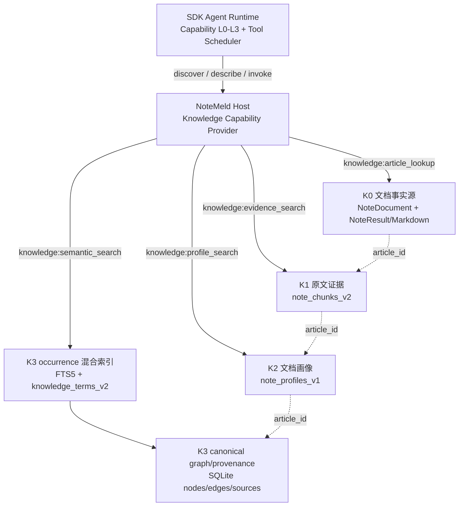

# K0-K3 文章级分层知识检索 Execution Spec

日期：2026-08-18
状态：Ready for Execution（尚未开发、尚未运行测试）
Canonical Requirement：[`2026-08-18-k0-k3-article-knowledge-retrieval.md`](../../requirements/2026-08-18-k0-k3-article-knowledge-retrieval.md)
实施计划：[`2026-08-18-k0-k3-article-knowledge-retrieval.md`](../plans/2026-08-18-k0-k3-article-knowledge-retrieval.md)
目标架构：[`2026-08-17-agent-sdk-single-runtime-architecture.md`](2026-08-17-agent-sdk-single-runtime-architecture.md)

## 0. 预检查与架构裁决

- [x] 已阅读 `docs/system/current-architecture.md`。
- [x] 已阅读 `docs/system/product-rules.md`。
- [x] 已阅读 `docs/system/data-model.md`。
- [x] 已阅读 `docs/system/api-inventory.md`。
- [x] 已阅读 `docs/system/known-pitfalls.md`。
- [x] 已阅读 `docs/system/change-spec-template.md`。
- [x] 已阅读 P6 Agent SDK 单一运行时 Requirement、目标架构和 capability/tool execution 边界。
- [x] 已阅读已实现的 L0-L3 渐进式能力路由 Requirement/Spec。
- [x] 已搜索 VectorStore、ingestion chunk、Wiki packet/search/semantic resolver、Agent Host ToolDriver 和相关测试。
- [x] 已确认本需求是 Knowledge Services 增量，不是第二套 Agent runtime。

架构术语固定如下：

| 术语 | 含义 | 所有者 |
| --- | --- | --- |
| K0-K3 | NoteMeld 知识数据层 | NoteMeld Knowledge Services |
| Capability L0-L3 | 能力地图、发现、描述、调用 | `notemeld-agent-sdk` |
| `article_id` | Agent/工具层文章主键；值等于现有 `task_id` | NoteMeld Product Policy/Adapter |
| CapabilityManifest | 工具 identity、summary、schema、risk、serial 等通用描述 | SDK contract，内容由 NoteMeld Provider 提供 |

## 1. 当前系统现状

### 1.1 相关模块

- `backend/app/services/vector_store.py`：per-task Chroma collection、legacy Markdown/transcript/meta chunk、ingestion chunk、全局 `wiki_terms`。
- `backend/app/services/ingestion/chunker.py`：page-aware KnowledgeChunk 和 EvidenceAnchor。
- `backend/app/models/knowledge_packet.py`：Wiki summary、entity、concept、claim、evidence、relation 数据对象。
- `backend/app/services/wiki_pipeline.py`、`wiki_store.py`：单篇 contribution 与 materialized Wiki 写入。
- `backend/app/services/wiki_search.py`：遍历 contribution/page 文件的关键词搜索。
- `backend/app/services/wiki_semantic_resolver.py`：实体/概念 canonical 归并和 `wiki_terms` vector helper。
- `backend/app/services/wiki_graph_analyzer.py`：`graph.json`/community materialization。
- `backend/app/services/migration/reindex_service.py`：导入后的索引重建入口。
- `backend/app/agent_host/drivers/tools.py`：P6 过渡期 ToolDriver adapter。

### 1.2 当前限制

- 不能跨全部文章执行一次共享 ANN；当前关联笔记检索需要已知 task_id。
- page metadata 已写入 ingestion chunk，但 query 没有 article/page filter contract。
- high-density summary 已在 contribution 中，但没有一文一条的共享 profile collection。
- K3 canonical term vector 主要用于语义归并；在线 WikiSearch 仍为文件遍历，不支持 article-scoped hybrid search。
- `graph.json` 是 snapshot/materialized page 数据，不适合作为大规模在线 adjacency 事实源。
- 当前旧 capability registry 仍在 Python；P6 最终要求 SDK Router/Tool Scheduler 为唯一 Agent 行为实现。

## 2. 目标架构



四个 capability 是同级产品能力。图中的数据关系不表示调用顺序；Agent 可调用任意一个或并行调用多个。

## 3. 标识与跨层不变量

### 3.1 `article_id`

- 对外字段名固定为 `article_id` 或 `article_ids`。
- 值必须与现有 `task_id` 完全相同；不增加 `articles` 主表，不复制 NoteDocument。
- Adapter 内部允许调用现有 task-based service，但 ToolResult 不暴露 collection name、本地路径或要求 Agent 转换 ID。
- 新工具不接受 `task_id` 作为公开参数，避免双字段歧义；旧 API/工具继续按现有契约工作。

### 3.2 article_ids 过滤语义

- 字段缺省或 null：允许全库搜索。
- 显式 `[]`：`invalid_arguments`。
- 非字符串、空字符串：`invalid_arguments`。
- 去重后最多 100 个，超过返回 `limit_exceeded`，不静默截断。
- K1/K2/K3 occurrence 必须在 scoring/ANN 前过滤；不能先全库 top_k 再丢弃集合外结果。
- K3 graph expansion 的边来源也必须和 article_ids 相交；没有受限 provenance 的边不能返回。

### 3.3 统一索引 record identity

```text
K1 record_id = sha256("K1|{article_id}|{chunk_id}|{content_hash}")
K2 record_id = sha256("K2|{article_id}|{profile_generation}|{content_hash}")
K3 occurrence_id = sha256("K3|{article_id}|{node_id}|{evidence_id_or_empty}|{mention_hash}")
canonical edge_id = sha256("EDGE|{source_node_id}|{relation_type}|{target_node_id}")
```

ID 必须可重复计算并用于幂等 upsert；hash 原文不进入日志。

## 4. K0 文档事实源规格

### 4.1 权威来源

读取顺序由现有服务决定，但语义权威为：

1. `note_documents` 的活动行提供 article metadata 和 canonical Markdown content。
2. `note_results/{task_id}.json` 提供 transcript/audio/source sidecar。
3. `note_results/{task_id}_markdown.md` 为兼容文件，不覆盖数据库中更新后的 canonical 语义。

不得接受用户传入文件路径。

### 4.2 K0 返回结构

```json
{
  "layer": "K0",
  "article_id": "task-001",
  "result_id": "task-001",
  "title": "Agentic RAG",
  "text": "有界正文或空字符串",
  "location": {
    "page_number": null,
    "section_path": null,
    "chunk_index": null,
    "start_time": null,
    "end_time": null
  },
  "metadata": {
    "source_url": "https://example.invalid/article",
    "platform": "web",
    "status": "SUCCESS",
    "wiki_status": "success"
  },
  "scores": {"vector": null, "bm25": null, "graph": null},
  "source_ref": {"evidence_id": null}
}
```

本地文件路径、Provider/model credential、sidecar debug payload 不进入 metadata。

## 5. K1 原文证据索引规格

### 5.1 collection

```text
name: note_chunks_v2
space: cosine
record type: one evidence chunk per record
```

全局只创建当前/候选 generation 的固定 collection，不按 article 创建 collection。

### 5.2 必需 metadata

```json
{
  "schema_version": "knowledge_chunk.v2",
  "record_type": "knowledge_chunk",
  "article_id": "task-001",
  "chunk_id": "task-001_chunk_12",
  "source_type": "document",
  "chunk_index": 12,
  "content_hash": "sha256",
  "embedding_version": "provider:model:dimension:normalization-version",
  "generation": 3
}
```

可选 metadata：`page_number`、`section_path`、`start_time`、`end_time`、`anchor_ids`、`resource_type`、`parser_name`、`confidence`、`workspace_id`、`access_scope`。

数组 metadata 必须按当前 Chroma/packaged runtime 支持情况保存；如果运行版本不支持数组 filter，anchor_ids 可序列化用于返回，但 article_id 仍保持 scalar pre-filter。

### 5.3 chunk 规则

- PDF/文档：保持 page 边界，先按段落合并；超过上限再做有 overlap 的二级切分，不跨页伪造 page provenance。
- Markdown：优先标题层级 + 段落；记录 section_path 和 chunk_index。
- Transcript：按时间窗口；记录 start/end time。
- 目标 chunk 尺寸与 overlap 由现有 ingestion/model-aware chunking 规则决定，本 Spec 不引入另一套 tokenizer。
- 同一 content hash/embedding version 不重复 embedding。

### 5.4 query where

```json
{
  "$and": [
    {"record_type": "knowledge_chunk"},
    {"generation": 3},
    {"article_id": {"$in": ["task-001", "task-002"]}},
    {"page_number": {"$gte": 3}},
    {"page_number": {"$lte": 10}}
  ]
}
```

只加入用户实际提供且适用于 source type 的 location predicate。

## 6. K2 高密文档画像规格

### 6.1 collection

```text
name: note_profiles_v1
record type: one active profile per article/generation
```

### 6.2 profile payload

```json
{
  "schema_version": "knowledge_profile.v1",
  "article_id": "task-001",
  "title": "Agentic RAG",
  "summary": "高密摘要",
  "topics": ["RAG", "Agent"],
  "key_claims": ["..."],
  "entity_ids": ["concept:rag"],
  "profile_status": "complete",
  "source_type": "web",
  "content_hash": "sha256",
  "embedding_version": "...",
  "generation": 2
}
```

embedding document 使用稳定模板：

```text
title: {title}
summary: {summary}
topics: {topics}
key claims: {bounded key_claims}
```

profile 的结构字段是结果和过滤权威；拼接 document 只用于 embedding，不反向解析成结构数据。

### 6.3 生成时机

- `WikiPipeline.extract_contribution()` 成功：从 KnowledgePacket 生成 complete profile。
- source-only partial：title + headings + 有界首段/末段 deterministic fallback，`profile_status=partial`。
- Note 保存成功后 profile 失败：更新 `knowledge_article_index_state.K2=failed`，不回滚 Note。
- contribution/profile content hash 未变：跳过 embedding 和 upsert。

## 7. K3 实体、概念、关系规格

### 7.1 为什么 canonical 与 occurrence 分离

一个 canonical concept 可属于数千篇文章。如果只在 canonical vector metadata 中保存 article_ids，更新会持续放大且无法可靠 pre-filter；如果按文章复制 canonical node，图会失去归并语义。

因此：

- SQLite canonical node/edge 负责全局语义身份和 adjacency。
- node/edge source 表负责 article/evidence provenance。
- FTS5 与 Chroma 检索 occurrence；每条 occurrence 有一个 scalar article_id。
- 查询结果按 node_id 去重并聚合当前 scope 内 provenance。

### 7.2 SQLite 表

#### `knowledge_nodes`

| 字段 | 类型/约束 | 语义 |
| --- | --- | --- |
| `id` | TEXT PK | canonical node id |
| `node_type` | TEXT NOT NULL | entity/concept |
| `canonical_name` | TEXT NOT NULL | canonical name |
| `normalized_name` | TEXT NOT NULL | deterministic normalized value |
| `aliases_json` | TEXT NOT NULL | JSON string array |
| `description` | TEXT NOT NULL | bounded canonical description |
| `confidence` | REAL NOT NULL | 0-1 |
| `created_at/updated_at` | DATETIME | timestamps |

唯一性：`(node_type, normalized_name)`。

#### `knowledge_node_sources`

| 字段 | 类型/约束 | 语义 |
| --- | --- | --- |
| `id` | TEXT PK | occurrence id |
| `node_id` | FK/index | canonical node |
| `article_id` | TEXT/index | equals task_id |
| `evidence_id` | TEXT nullable/index | contribution evidence |
| `mention_text` | TEXT | bounded source mention |
| `description_snapshot` | TEXT | per-article description |
| `confidence` | REAL | 0-1 |
| `content_hash` | TEXT | idempotency |
| `generation` | INTEGER/index | active generation |

唯一性：`(node_id, article_id, evidence_id, content_hash)`。

#### `knowledge_edges`

| 字段 | 类型/约束 | 语义 |
| --- | --- | --- |
| `id` | TEXT PK | canonical edge id |
| `source_node_id` | FK/index | source |
| `target_node_id` | FK/index | target |
| `relation_type` | TEXT/index | typed relation |
| `weight` | REAL | aggregate weight |
| `created_at/updated_at` | DATETIME | timestamps |

唯一性：`(source_node_id, relation_type, target_node_id)`。

#### `knowledge_edge_sources`

| 字段 | 类型/约束 | 语义 |
| --- | --- | --- |
| `id` | TEXT PK | provenance id |
| `edge_id` | FK/index | canonical edge |
| `article_id` | TEXT/index | equals task_id |
| `evidence_id` | TEXT nullable/index | support evidence |
| `confidence` | REAL | 0-1 |
| `generation` | INTEGER/index | active generation |

唯一性：`(edge_id, article_id, evidence_id)`。

#### `knowledge_article_index_state`

| 字段 | 类型/约束 | 语义 |
| --- | --- | --- |
| `article_id` | TEXT PK | equals task_id |
| `k1_status/k2_status/k3_status` | TEXT | pending/running/success/partial/failed/canceled |
| `k1_hash/k2_hash/k3_hash` | TEXT | source content hashes |
| `embedding_version` | TEXT | current version |
| `generation` | INTEGER | index generation |
| `error_code/error_message` | TEXT | safe bounded diagnostic |
| `updated_at` | DATETIME | timestamp |

### 7.3 FTS5 occurrence index

`ensure_knowledge_schema()` 创建：

```sql
CREATE VIRTUAL TABLE IF NOT EXISTS knowledge_occurrences_fts USING fts5(
  occurrence_id UNINDEXED,
  article_id UNINDEXED,
  node_id UNINDEXED,
  node_type UNINDEXED,
  name,
  aliases,
  description,
  mention_text,
  tokenize='trigram'
);
```

- packaged Python SQLite 必须通过 FTS5/trigram probe；不满足时 lexical K3 返回 `knowledge_fts_unavailable`，不扫描文件降级。
- 1-2 字符精确实体查询先查 normalized canonical name/alias B-tree，再执行 trigram FTS。
- 排序使用 FTS5 `rank`/`bm25()` 语义；原始值只进入 debug metrics，不直接和 cosine 比较。

### 7.4 K3 vector occurrence collection

```text
name: knowledge_terms_v2
record id: occurrence_id
document: canonical name + aliases + description + mention text
metadata: article_id, node_id, node_type, evidence_id, generation, content_hash
```

### 7.5 融合和图扩展

- lexical top 40 + vector top 40，分别按 rank 输入 RRF。
- 默认 `rrf_k=60`；配置为服务常量并由离线评测调整，不暴露给普通 Agent 参数。
- 合并后按 node_id 去重，保留 scope 内最多 10 条 provenance。
- seed 默认 top 10；每个 seed 每 hop 最大 20 edges；总节点最大 50、总边最大 80、总 provenance 最大 100。
- hops 默认 1，允许 0-2；0 表示只检索节点不扩图。
- relation_types/node_types 在 SQL/occurrence 查询中预过滤。

## 8. 四个 CapabilityManifest

### 8.1 `knowledge:article_lookup`

```json
{
  "type": "object",
  "properties": {
    "article_ids": {"type": "array", "items": {"type": "string"}, "maxItems": 100},
    "filters": {
      "type": "object",
      "properties": {
        "title_contains": {"type": "string"},
        "source_types": {"type": "array", "items": {"type": "string"}},
        "created_after": {"type": "string"},
        "created_before": {"type": "string"}
      }
    },
    "include_content": {"type": "boolean", "default": false},
    "location": {"$ref": "knowledge.location.v1"},
    "max_chars": {"type": "integer", "minimum": 1, "maximum": 12000, "default": 6000}
  }
}
```

约束：article_ids 缺省时 filters 至少有一个有效字段；否则拒绝无界 K0 listing/content。

### 8.2 `knowledge:evidence_search`

```json
{
  "type": "object",
  "properties": {
    "query": {"type": "string", "minLength": 1, "maxLength": 2000},
    "article_ids": {"type": "array", "items": {"type": "string"}, "maxItems": 100},
    "source_types": {"type": "array", "items": {"type": "string"}},
    "location": {"$ref": "knowledge.location_filter.v1"},
    "top_k": {"type": "integer", "minimum": 1, "maximum": 50, "default": 10}
  },
  "required": ["query"]
}
```

### 8.3 `knowledge:profile_search`

```json
{
  "type": "object",
  "properties": {
    "query": {"type": "string", "minLength": 1, "maxLength": 2000},
    "article_ids": {"type": "array", "items": {"type": "string"}, "maxItems": 100},
    "filters": {
      "type": "object",
      "properties": {
        "source_types": {"type": "array", "items": {"type": "string"}},
        "profile_status": {"type": "array", "items": {"enum": ["complete", "partial"]}},
        "created_after": {"type": "string"},
        "created_before": {"type": "string"}
      }
    },
    "top_k": {"type": "integer", "minimum": 1, "maximum": 50, "default": 20}
  },
  "required": ["query"]
}
```

### 8.4 `knowledge:semantic_search`

```json
{
  "type": "object",
  "properties": {
    "query": {"type": "string", "minLength": 1, "maxLength": 2000},
    "article_ids": {"type": "array", "items": {"type": "string"}, "maxItems": 100},
    "node_types": {"type": "array", "items": {"enum": ["entity", "concept"]}},
    "relation_types": {"type": "array", "items": {"type": "string"}},
    "hops": {"type": "integer", "minimum": 0, "maximum": 2, "default": 1},
    "top_k": {"type": "integer", "minimum": 1, "maximum": 50, "default": 20}
  },
  "required": ["query"]
}
```

### 8.5 Manifest 调度属性

| identity | risk | serial | approval | 说明 |
| --- | --- | --- | --- | --- |
| `knowledge:article_lookup` | safe-read | false | none | 有界读取 |
| `knowledge:evidence_search` | safe-read | false | none | ANN read |
| `knowledge:profile_search` | safe-read | false | none | ANN read |
| `knowledge:semantic_search` | safe-read | false | none | FTS/vector/graph read |

四个 manifest 没有 `depends_on` 或 knowledge stage。SDK 通用 policy 可以要求 L2 describe 后 L3 invoke，但不得要求调用另一个 knowledge identity。

## 9. 统一 ToolResult 协议

### 9.1 成功

```json
{
  "schema_version": "knowledge_result.v1",
  "capability_id": "knowledge:semantic_search",
  "query": "RAG 与 Agent 的关系",
  "scope": {
    "article_ids": ["task-001", "task-002"],
    "filters_applied": true
  },
  "total": 1,
  "partial": false,
  "results": [
    {
      "layer": "K3",
      "article_id": null,
      "result_id": "concept:rag",
      "title": "RAG",
      "text": "Retrieval-Augmented Generation",
      "location": {
        "page_number": null,
        "section_path": null,
        "chunk_index": null,
        "start_time": null,
        "end_time": null
      },
      "scores": {"vector": 0.84, "bm25": -4.31, "graph": 0.5, "fusion": 0.031},
      "source_ref": {"node_id": "concept:rag", "edge_ids": []},
      "provenance": [
        {"article_id": "task-001", "evidence_id": "task-001:evidence:3", "confidence": 0.9}
      ]
    }
  ],
  "diagnostics": {
    "index_generation": 3,
    "elapsed_ms": 42
  }
}
```

`diagnostics` 只含安全指标，不含本地路径、query embedding、Provider payload 或 credential。

### 9.2 失败

```json
{
  "schema_version": "knowledge_result.v1",
  "capability_id": "knowledge:evidence_search",
  "total": 0,
  "partial": false,
  "results": [],
  "error": {
    "code": "index_unavailable",
    "message": "知识索引暂不可用，请重建后重试",
    "retryable": true
  }
}
```

安全错误码：

- `invalid_arguments`
- `limit_exceeded`
- `article_not_found`
- `permission_denied`
- `index_unavailable`
- `index_stale`
- `query_timeout`
- `cancelled`
- `internal_error`

Provider/SQLite/Chroma 原始异常只进入脱敏日志分类，不返回模型或 UI。

## 10. Agent 调用说明

### 10.1 自由组合原则

这些是建议而不是强制状态机：

| 问题类型 | Agent 可选调用 |
| --- | --- |
| 已知 article_id、读取原文 | `article_lookup` |
| 已知文章范围、找具体证据 | `evidence_search` |
| 宽泛主题、先圈定文章 | `profile_search` |
| 实体消歧、关系、多跳 | `semantic_search` |
| 同时需要主题和关系候选 | 并行 `profile_search` + `semantic_search` |
| 候选文章需要证据 | 任一工具结果 article_id → `evidence_search` |

### 10.2 禁止的 Host 行为

- 不维护 `last_knowledge_layer`。
- 不因 K3 空结果阻止 K1/K2。
- 不因 K2 未调用拒绝 K1。
- 不把 suggested workflow 转成 server-side prerequisite。
- 不在 Agent 调用前自动执行完整 K3/K2/K1 流水线。
- 不让 ToolDriver 绕过 SDK 另开模型或工具循环。

### 10.3 允许的 Product Policy

- `use_wiki=false`/权限 allowlist。
- article_ids、top_k、hops、max_chars、timeout 和总结果字节上限。
- context refs 解析和显式 linked article 默认值。
- safe-read risk、并发预算和取消。
- 来源完整性检查；没有 provenance 的结果不能作为 NoteMeld 来源投影。

## 11. 索引生命周期与事务边界

### 11.1 Note 保存

```text
Note canonical save succeeds
  -> enqueue/update K1/K2/K3 index state
  -> background index work
  -> each layer independently success/partial/failed
```

Note canonical save 是不可回滚成功边界。K1/K2/K3 任一失败不删除 Note、不回写任务失败；错误作为独立 index status 可重试。

### 11.2 generation 切换

1. 创建新 generation state。
2. 增量写入 versioned collection/SQLite source rows。
3. 完成完整性检查：record count、article state、embedding dimension、FTS probe。
4. 原子更新 active generation pointer。
5. 延迟清理无活动 reader 的旧 generation；至少保留一个可回滚 generation。

禁止先删除 live collection 再重建。

### 11.3 删除

1. Note 软删除先使查询层排除 article_id。
2. 写 tombstone/index state。
3. 删除 K1/K2 records、K3 node/edge sources、FTS/vector occurrences。
4. 在事务中重算 source_count。
5. 只有 source_count=0 才清 canonical orphan node/edge；`graph.json` 后台 rematerialize。

### 11.4 导入和迁移

- import job 返回成功时必须另有 index job id/status。
- reindex 按 article checkpoint，可取消、续跑、latest-wins。
- legacy per-task collections 和 Wiki files 在 v2 验收前保留。
- 旧数据没有 article_id 字段时，使用其 task_id/source_id 同值恢复；无法解析的条目记录 partial，不猜测关联。

## 12. 性能、容量和可观测性

### 12.1 目标数据集

- 100,000 profiles。
- 700,000-1,500,000 K1 chunks。
- 可配置 500,000-2,000,000 K3 occurrences。
- 可配置 1,000,000 级 edge provenance。

### 12.2 查询预算

| 工具 | 默认 top_k | 最大 top_k | 目标 P95 |
| --- | --- | --- | --- |
| K0 article_lookup | 20 metadata / 1 content | 100 metadata / 12k chars | ≤100ms |
| K1 evidence_search | 10 | 50 | ≤500ms（article_ids≤50） |
| K2 profile_search | 20 | 50 | ≤300ms（global） |
| K3 semantic_search | 20 | 50 | ≤500ms（1 hop） |

基准环境：8 核 CPU、32GB RAM、NVMe、warm index、单请求者。并发吞吐另记，不把单请求延迟外推为团队 QPS。

### 12.3 指标

- `knowledge_query_latency_ms{layer,scope}`
- `knowledge_query_result_count{layer}`
- `knowledge_query_empty_total{layer}`
- `knowledge_index_records{layer,generation}`
- `knowledge_index_failures_total{layer,code}`
- `knowledge_reindex_progress{generation}`
- `knowledge_tool_calls_total{capability,status}`
- `knowledge_filter_article_count`

日志只记录 hash/数量/安全 code，不记录完整 query 原文、正文、路径或 Provider payload。

## 13. 迁移兼容与回滚

### 13.1 兼容

- `note_documents.task_id`、TaskStatus、NoteResult/Wiki files 不变。
- 旧 `wiki_terms` 可继续服务 semantic resolver；K3 online occurrence 使用新 `knowledge_terms_v2`。
- 旧 per-task collection 不立即删除；明确单篇 fallback 可在迁移期使用。
- 旧 builtin tools 不被本需求原地改名；P6 cutover 后四个新 capability 成为新 Agent 的知识入口。
- `graph.json` 和 entity/concept/source pages 继续供现有 Wiki UI 读取。

### 13.2 回滚

- 停止注册四个新 CapabilityManifest。
- active generation pointer 切回最近完整 generation。
- 保留新表、新 collection 和 index state，避免数据破坏；后续由确认过的清理 job 删除。
- 不恢复第二套 Python Agent loop；Agent runtime 回滚仍服从 P6 规则。
- 不删除用户 Note、Wiki、Conversation、Provider、Model、Usage 或 Whiteboard。

## 14. 测试规格

### 14.1 数据契约

- article_id=task_id 同值映射。
- K0-K3 provenance 完整性。
- article_ids 缺省/空/超限/重复/不存在。
- location page/section/time 互斥与空值。
- unified result schema snapshot。

### 14.2 K1/K2

- shared collection 数不随 article 增长。
- metadata pre-filter 零越界。
- page range、section、time filter。
- unchanged hash 跳过 embedding。
- partial profile 与 complete profile 区分。
- legacy single-article fallback 只在明确 article_id 时生效。

### 14.3 K3

- semantic aliases 收敛到一个 canonical node。
- occurrence 按 article 分离并可预过滤。
- BM25、vector、RRF deterministic fixture。
- 1-2 字符 alias exact fallback。
- 0/1/2 hop 上限和 relation type filter。
- 删除单篇 provenance 不误删共享节点。
- FTS5/trigram 缺失 fail-closed，不扫描 Wiki 文件。

### 14.4 工具独立性

至少覆盖：

```text
K0
K1
K2
K3
K2 -> K1
K3 -> K1
K2 || K3
K3 -> K2 -> K0
K3 empty -> K1 still allowed
K1 direct without K2/K3
```

每个 case 从新的 invocation context 开始，并断言 handler 不读取 prior call state。

### 14.5 Agent Host/P6

- L1 只返回四个 identity/summary，不泄露 schema/storage。
- L2 只描述选中 identity。
- L3 任一工具可直接 invoke。
- use_wiki=false 注册/invoke 双门禁。
- ToolDriver cancel、parallel、stable result order。
- ToolResult 来源进入 SDK event/projection。
- SSE replay 不重复来源；同 Turn 单终态。
- SDK/Host version mismatch fail-closed。

### 14.6 迁移和删除

- empty DB init、legacy DB init、重复 init。
- import 后创建 reindex job。
- cancel/restart/latest-wins。
- generation 未 ready 不切换。
- Note 成功 + K2/K3 失败不回滚。
- soft delete 立即查询不可见，异步清理最终完成。

### 14.7 10 万篇 benchmark

benchmark 不进入普通 CI timeout；使用固定 seed 并输出：

- corpus/record counts。
- collection count。
- build time、disk、peak RSS。
- 每类查询 P50/P95/P99、empty rate、filter leakage。
- 失败查询和超时。
- 硬件与软件版本。

## 15. 执行和验证命令

实现时按 Task 范围逐步运行，最终必须运行：

```bash
python3 -m compileall backend/app
PYTHONPATH=backend python3 -m pytest backend/tests/knowledge -q
PYTHONPATH=backend python3 -m pytest backend/tests/agent_host -q
PYTHONPATH=backend python3 -m pytest backend/tests/test_core_ingestion_contracts.py backend/tests/test_core_migration_contracts.py backend/tests/test_core_migration_api_contracts.py backend/tests/test_wiki_semantic_incremental_merge.py backend/tests/test_wiki_article_view_contracts.py -q
cd frontend && pnpm test:contracts
cd frontend && pnpm build
scripts/run_core_regression.sh
python3 scripts/benchmark_knowledge_retrieval.py --articles 100000 --output docs/superpowers/tests/artifacts/knowledge-retrieval-100k.json
```

验证证据目标：`docs/superpowers/tests/2026-08-18-k0-k3-article-knowledge-retrieval.md`。

## 16. 验收映射

| Requirement AC | 实现 Task | 验证 |
| --- | --- | --- |
| 1 | 1-6 | schema/provenance tests |
| 2、5 | 1、4、5、7 | article filter contracts |
| 3-4 | 2、6 | K3 canonical/occurrence/graph tests |
| 6-8 | 1、7、9 | tool independence + Host tests |
| 9-10 | 4-6、11 | collection/online-path benchmark |
| 11 | 11 | 100k P95 evidence |
| 12 | 5 | profile generation tests |
| 13 | 4-6、8 | Note success boundary tests |
| 14 | 8 | generation/reindex tests |
| 15 | 2、8 | delete/provenance cleanup tests |
| 16 | 7、9 | Product Policy dual gate tests |
| 17 | 9-10 | P6 manifest/driver/event tests |
| 18 | 12 | final regression/evidence |

## 17. Agent 开工前必答问题

| 问题 | 回答 |
| --- | --- |
| 影响哪些已有模块？ | VectorStore、ingestion、Wiki pipeline/store/search/semantic resolver、migration/reindex、Note deletion、Agent Host ToolDriver、P6 capability/event projection。 |
| 当前是否已有类似能力？ | 有 per-task vector、Wiki packet/graph、wiki_terms 和旧 progressive registry；缺共享 article-scoped K0-K3 query contract。 |
| 是否和产品规则冲突？ | 不冲突；强化 Wiki-First、来源追溯和按需调用，保留本地优先。 |
| 是否和数据模型冲突？ | 不改 task_id；新增 knowledge 索引/provenance 表和 active generation，需要幂等 schema 与文档同步。 |
| 是否会重新引入 known pitfalls？ | Spec 明确禁止同步 full rebuild、迁移不 reindex、Note 后处理回滚正文、固定 tmp、文件扫描 fallback、双 Agent runtime 和敏感 payload。 |
| 是否影响本地数据或线上服务？ | 新增本地 SQLite/Chroma 数据；不新增远端持久服务。 |
| 最小可行改动是什么？ | 先交付共享 K1/K2、K3 occurrence/provenance、四个服务工具；只在 P6 正式 ToolDriver 就绪后接 Agent。 |
| 需要补哪些测试？ | 数据/过滤/独立工具/K3 融合/reindex/delete/P6 Host/source projection/打包 FTS/100k benchmark。 |

## 18. 完成定义

只有同时满足以下条件才可把 Requirement 标记 Implemented：

- K0-K3 与四工具代码按本 Spec 落地。
- P6 Agent Host 正式路径可 discover/describe/invoke 四工具，且没有旧 Agent 兼容实现。
- Requirement AC 1-18 都有验证证据。
- 10 万篇 benchmark 记录真实硬件、版本、容量和 P95，并达到目标或由用户明确接受未达项。
- system/current-architecture、product-rules、data-model、api-inventory、known-pitfalls、changelog 已同步为实现后的真实事实。
- test evidence 已创建且只包含命令、关键结果、指标和失败原因。
